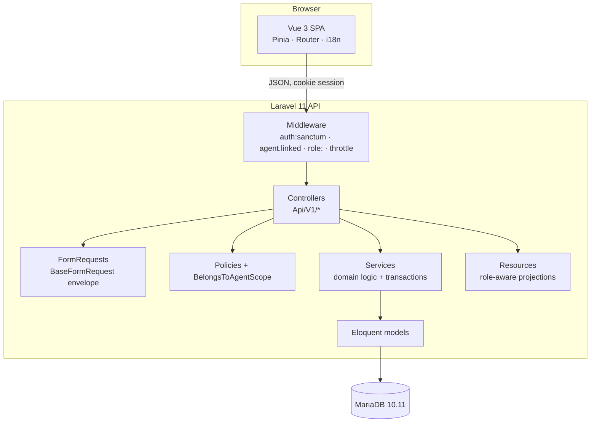
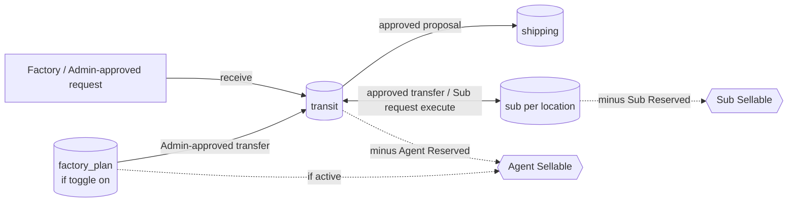
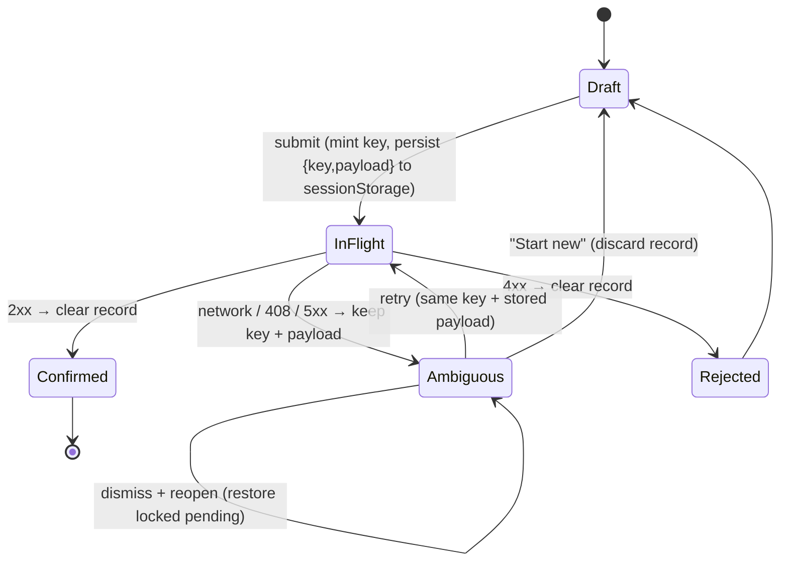

# Prime Classy — Technical Architecture

How the system is built. Behavioural rules are in [BUSINESS-RULES.md](BUSINESS-RULES.md); the system overview is [MASTER-SYSTEM.md](MASTER-SYSTEM.md); runbooks are [OPERATIONS.md](OPERATIONS.md). Everything here is verified against source; names refer to `backend/app/...` and `frontend/src/...`.

## 1. Overview



Request path: **route role gate → FormRequest shape validation → controller `authorize()` (Policy) → Service (authoritative rules, DB transaction, locks) → Resource (role-filtered output)**. Authority is never decided in one layer alone.

## 2. Backend structure

| Layer | Location | Notes |
|---|---|---|
| API surface | `routes/api_v1.php` | One file; groups by `role:` middleware; throttles on auth/checkout/webhooks/Sheets |
| Controllers | `app/Http/Controllers/Api/V1/{Address,Admin,Agent,Auth,Catalog,Checkout,Cms,Courier,Fee,Fulfillment,Install,Integration,Language,Media,Order,Payment,Referral,Region,Report,Return,Settings,Stock,User,Webhook}` | Thin: authorize → service → resource. `ok()/created()/fail()` produce the envelope |
| FormRequests | `app/Http/Requests/*` (extend `BaseFormRequest`) | Shape validation only; failures render `{success:false, message, errors}` 422. Business validation that depends on state lives in services |
| Policies | `app/Policies/*` | Record-level authority (Order, Shipment, DeliveryVerification, StockRequest/Proposal/Transfer/Opname/Handover, SubStockRequest, WarehouseSubLocation, WarehouseStockRequest, User, Product…). `OrderPolicy::addLine` = Admin-only, same Agent |
| Global scope | `app/Models/Scopes/BelongsToAgentScope` | Confines Order/ProductStock/ProductVariationStock queries to the actor's Agent (not applied to `User` to avoid auth recursion) |
| Services | `app/Services/{Order,Payment,Stock,Report,Shipping,GoogleSheets,Hierarchy,Referral,User,Fee,Checkout,Cms,Media,Region,Sanitizer,Setting,Export,Logging,Product,Maintenance}` | All business logic and transactions |
| Resources | `app/Http/Resources/*` | `OrderResource`/`OrderItemResource` (financial vs operational projection), `CourierOrderResource` (minimal pre-claim vs assigned), report/warehouse resources |
| Models | `app/Models/*` (~80) | Snapshots, enums, relations; `SoftDeletes` on users/products/variations |
| Support | `app/Support/*` | `ApiResponse`, `HierarchyRules`, `PermissionMap` (UI hints), `InstallLock`, `SafeSchema` |
| Exceptions | `app/Exceptions/*` | `ApiException(message, status, errors)` → envelope; `InsufficientStockException`, `InvalidStateTransitionException`, `ShippingQuoteException` |
| Console | `app/Console/Commands/*` | `regions:import`, `products:backfill-sku`, `system:audit-catalog-hierarchy`, `warehouse:reconcile`, `warehouse:migrate-legacy-stock`, `transactions:reset` (legacy), `primeclassy:reset-dev-transactions` (DEV only) |

## 3. Canonical services

**Financial** (one writer per concern)

| Concern | Owner |
|---|---|
| Order totals after creation | `OrderTotalCalculator::recalculate` (only writer of `subtotal_amount`/`total_amount`) |
| `paid_amount`, `remaining_amount`, `payment_status` | `PaymentService` (`applyPaymentToOrder`, `reverseAppliedPayment`, `reconcileTotals`, `initiateAdditionalPayment`) |
| Payment summary shown anywhere | `PaymentSummaryService::summarize` |
| Fees snapshot | `FeeService::resolveForLine` → `OrderService::priceAndReserveLine` |
| Commission rows | `OrderService::recordCommission` (agent/sales), `CourierService::recordCommissionsForItems` (courier) |
| Additional-payment obligation rule | `OrderFulfillmentService::reconcileAdditionalObligation` (shared by fulfilment increase and SC-03) |

**Inventory**

| Concern | Owner |
|---|---|
| Agent reserve / release / lock helpers | `StockService` (`reserveFor*`, `release*`, `lockReservationTarget(s)`, `canonicalReservationTargets`) |
| Sellable formula | `SellableStockService` (+ `WarehouseStockService` orchestration) |
| Sub reservation lifecycle | `SubStockService` (`reserve`, `consume`, `release`, `reduce`, `increase`, `lockReservationTargets`) |
| Stock source decision | `StockSourceResolver` |
| Sub Location ownership | `SubLocationOwnershipService` |
| Order Stock Request | `StockRequestService` (create on `diproses`, `lockActiveRequestForOrder`, `appendItemForOrderItem`) |
| Proposal / approval (Agent physical move) | `StockRequestProposalService`; `StockRequestFulfillmentService` is a disabled stub (direct fulfilment returns 422) |
| Transfers / handovers | `StockTransferService` |
| Warehouse requests / opname | `WarehouseStockRequestService`, `StockOpnameService` |
| Sub requests | `SubStockRequestService` |
| Cancellation reversal | `InventoryCancellationService` |
| Returns | `ReturnService` (`requestReturn`, `review`, `inspectReturn`, `finalizeInspection`, pickup/confirm, `markItemRefunded`) |
| Order lifecycle | `OrderService` (create, status, cancel), `OrderFulfillmentService` (quantity/reschedule/split), `OrderLineAdditionService` (SC-03), `CourierService`, `DeliveryVerificationService` |
| Shipment grouping (Order + delivery date) | `ShipmentGroupingService` (`resolveMutableShipmentFor`, `assignItemToDateGroup`, `reconcileOrder`) — the only shipment writer for checkout, SC-03, reschedule and split; `shipments:regroup` for existing orders |

## 4. Stock and reservation representation



- `warehouse_stocks(agent_id, product_id|product_variation_id, stock_type, sub_location_id, quantity)`; `stock_type ∈ transit, factory_plan, shipping, sub`; `sales` is never stored.
- Legacy `product_stocks` / `product_variation_stocks`: `quantity_reserved` is the **Agent reservation commitment** (still authoritative); `quantity_on_hand` is a legacy projection. Manual legacy adjustment is locked by `config('warehouse.authoritative')`.
- `sub_stock_reservations` (one per `order_item_id`, UNIQUE; `active → consumed | released`). `order_items.stock_source` (`agent|sub`) + `sub_location_id` with a DB CHECK.
- `stock_movements`: immutable, signed, typed (`reserve, release, transfer_in/out, fulfillment, cancellation_release, return_restock, opname_adjustment, out, sub_adjustment, legacy_backfill …`), target XOR (`product_id` / `product_variation_id`), referencing the owning document.

## 5. Transaction boundaries

Each mutating operation is one `DB::transaction` that takes its locks first and writes the document, stock, movements, financial effect and audit row together. `StockService::reserve*` deliberately does not open its own transaction so it composes inside `OrderService`/`OrderLineAdditionService`. Idempotent replays resolve **before** creation-only validation. Operations that can be retried carry a persisted key or a unique constraint (see §8).

## 6. Order creation and SC-03 flows

```mermaid
sequenceDiagram
  participant A as Admin (SPA)
  participant C as OrderFulfillmentController::addItem
  participant S as OrderLineAdditionService
  participant DB as MariaDB
  A->>C: POST /orders/{id}/items (Idempotency-Key, payload)
  C->>C: authorize(addLine); validate key (1..100 chars)
  C->>S: addLine(...)
  S->>DB: BEGIN; lock Order
  S->>DB: replay? (order_id, idempotency_key) → compare fingerprint
  alt same fingerprint
    S-->>C: existing line (replay=200)
  else different
    S-->>C: 409
  else new
    S->>S: status=diproses? no Sub items? date not past?
    S->>DB: lock Stock Request (active)
    S->>DB: lock inventory targets (canonical) → reserve
    S->>DB: OrderItem + fingerprint, Shipment, StockRequestItem, commissions
    S->>DB: recalc totals → reconcile payment → obligation → audit
    S-->>C: new line (201); COMMIT
  end
  C->>DB: refresh order + relations
  C-->>A: OrderResource (persisted truth)
```

Checkout (`OrderService::createOrder`) follows the same discipline: resolve lines once (`resolveLine` → effective inventory target), take the canonical locks, snapshot + reserve + commission per line, create one Shipment per item, and create the Stock Request when the order starts in `diproses`. `priceAndReserveLine` is shared with SC-03 (`addReservedLine`).

## 7. Locking and deadlock prevention

Locks are always acquired in these orders. **Do not introduce a second ordering vocabulary.**

| Path | Lock order |
|---|---|
| Agent capacity (checkout, cancellation, Transit→Sub approval/execution) | targets sorted by `StockService::canonicalTargetKey` (`p:{id}` / `v:{id}`); per target: Agent commitment row → warehouse Transit/Plan rows (`lockReservationTargets`) |
| Sub-domain | `WarehouseSubLocation` parent → Sub `WarehouseStock` target rows (canonical order) → Sub reservation rows |
| Sub checkout | **shared** lock on the Sub Location (re-validated: active, same Agent, still owned) → Sub stock targets → reservations; the Gudang executor takes the location **exclusively** first, so no cycle |
| Warehouse proposal approval | Proposal → Stock Request → per sorted target: Transit → Shipping → Agent commitment row |
| **SC-03 add-line / quantity adjustment** | Order → **Stock Request** → Agent targets (canonical) → items/shipment. Stock Request precedes inventory so it matches proposal approval and cannot deadlock against it |
| Shipment grouping (any writer) | Order row lock first (OrderItem → Order for reschedule/adjust); the Order lock serialises every resolver call, so two writers cannot create duplicate mutable shipments for one Order + date (no unique index needed) |
| Per-product proposal decision | Proposal → Stock Request → per sorted target (Transit → Shipping → Agent row); only the selected lines are processed |
| Quantity adjustment / Keuangan settlement | Adjustments lock `OrderItem`/`Order` and use plain (non-locking) reads for pending-obligation guards; settlement locks the financial row first — the two orders were deliberately kept cycle-free |

Reconciliation rule (REPEATABLE READ): when a status or total is derived from rows that another transaction may have just committed while this one waited for a lock, use **locking reads** (`lockForUpdate()->get()` then sum in PHP), never a plain `sum()` that would use the pre-wait snapshot. `StockRequestService::appendItemForOrderItem` and `StockRequestProposalService::approve` follow this. Deadlocks are fixed by ordering, not by sleeps or catching 1213.

## 8. Idempotency

| Operation | Mechanism |
|---|---|
| Order creation | `Idempotency-Key`; `UNIQUE(konsumen_id, idempotency_key)`; duplicate returns the original order |
| Delivery verification | Required key; `UNIQUE(verified_by, idempotency_key)`; identical content replays, otherwise 409 |
| Sub stock request create | Optional key; unique per requester |
| Order stock-request fulfilment (approval) | Persisted `stock_request_fulfillments.idempotency_key` (`proposal-{id}` for a whole-proposal action, `proposal-item-{ids}` per line); a line already decided is a no-op |
| Sub request execute / transfer approve / opname approve / reservation reserve/consume | State-based: terminal status returns the existing result; per-item UNIQUE rows |
| Payment webhooks | `UNIQUE(payment_method_id, event_id)`; races return `duplicate` |
| **SC-03 add-line** | Required key (non-blank, ≤ 100); `UNIQUE(order_id, idempotency_key)` on `order_items` + immutable **request fingerprint** |

**Request fingerprint** (`order_items.request_fingerprint`, SHA-256, written once with the line, never updated): `{product_id, product_variation_id|null, quantity, requested_delivery_date|null, additional_payment_method}`; `reason` is excluded (audit note). Same key + same fingerprint ⇒ replay; different ⇒ 409; the unique-index race path also compares fingerprints. Rows without a fingerprint (pre-remediation DEV rows) fall back to product/variation/quantity identity.

## 9. Frontend request identity (`secureUuid`)

`src/utils/uuid.ts::secureUuid()` is the **only** generator of idempotency/transaction identifiers: native `crypto.randomUUID()` → RFC 4122 v4 from `crypto.getRandomValues()` → otherwise throws (never `Math.random`/`Date.now`). Call sites: checkout, delivery verification, Sub stock requests, SC-03.

`src/utils/addLineSubmission.ts` plus `OrderDetailView.vue` implement the SC-03 submission lifecycle:



The backend 409 is the final guard if a key ever meets a changed payload.

## 10. Audit logging

`ActivityLogger::log(causerId, subject, event, description, properties)` writes `activity_logs` (never raw inserts); secret keys are redacted; IP and user agent captured server-side. Domain events cover users/referrals, payments, orders (`order.status_changed`, `order_item.added`), fulfilment, shipments/receipts, returns, stock, settings, products, Sub Locations. Some services write `ActivityLog` rows directly for warehouse documents.

## 11. Frontend architecture

- **Routing:** `router/index.ts` (history mode) with `requiresAuth`, `guestOnly`, role meta and an installer guard; dashboard routes under `DashboardLayout`, storefront under `ShopLayout`, auth under `AuthLayout`, print under `views/print`.
- **State:** Pinia stores `auth`, `cart`, `wishlist`, `locale`, `site`, `ui` (dark mode), `install`.
- **API:** `src/api/client.ts` (Axios, `withCredentials`, XSRF header; base URL from `window.__APP_CONFIG__.API_URL` runtime config, `''` = same origin) and one module per resource (`orders`, `payments`, `warehouse`, `subStock`, `proposals`, `transfers`, `opnames`, `deliveries`, `orderAdjustments`, `reports`, `catalog`, …). `ApiError` carries `status` and field errors.
- **Navigation:** `dashboard/navConfig.ts` builds the role-aware sidebar; backend remains authoritative.
- **i18n:** vue-i18n with `id`, `en`, `ar` (RTL), `zh`; backend messages in `lang/{id,en,ar,zh}` selected by `SetLocale`.
- **Build:** Vite 8 + `@tailwindcss/vite`; type-check by `vue-tsc`.

## 12. Integrations

| Integration | Where | Notes |
|---|---|---|
| OpenRouteService | `Services/Shipping/Providers/OpenRouteProvider`, `OpenRouteDistanceCalculator` | Base URL server-controlled; route cached 5 min; failure ⇒ 422, no fallback charge |
| RajaOngkir / Komerce V2 | `Providers/RajaOngkirProvider` | Rates cached 5 min, destination mapping 30 days; selection re-verified at order creation |
| Payment gateways | `Services/Payment/Gateways/*` | Per-Agent encrypted config (`agent_payment_gateway_configs`); webhook `POST /webhooks/payment/{method}` |
| Google Sheets | `Services/GoogleSheets/{DatasetRegistry,SyncService,SheetsClient}` | Whitelisted dataset/column registry; server-side service account; one-way |
| Google Maps | frontend only | Public key; private provider keys never reach the browser |

## 13. Security boundaries

Route role → Policy → `BelongsToAgentScope` → service re-checks. Server-derived money/stock; encrypted credentials never serialized; `HtmlSanitizerService` for HTML; real MIME/decode checks and generated names for uploads; Sanctum CSRF; throttling; `APP_DEBUG=false` in production; the installer endpoints (`/api/v1/install/*`) are CSRF-exempt but sealed by the `not.installed` middleware, which returns 403 once `storage/app/installed.lock` exists (the status endpoint also reports `has_super_admin`). Gudang/Kurir get operational resource projections with no financial fields.

## 14. Testing architecture

- PHPUnit `tests/Feature` (real DB, policies, services, migrations) and `tests/Unit`. `Tests\TestCase` refuses any database whose name does not match `_test(ing)`; the DB is `primeclassy_testing`.
- Most suites use `RefreshDatabase`. Race suites use `RestoresIsolatedTestDatabase` (committed fixtures + rebuild) with `Tests\Support\ConcurrencyHarness`, which spawns real second PHP processes (`.phpunit-concurrency-actor.php`, whitelisted operations such as `add-line`, `proposal-approve`, `agent-reserve`, `checkout-order`) to produce **true two-connection overlap** and assert no deadlock (1213), no oversell and conserved inventory.
- `scripts/run-tests-serialized.php` serializes destructive migration/refresh suites with a lock and refuses non-testing databases.
- Deterministic lock-order assertions (query-log inspection) complement races where timing alone cannot prove ordering.
- No frontend test framework; verification is `vue-tsc`, the Vite build and manual browser checks.
