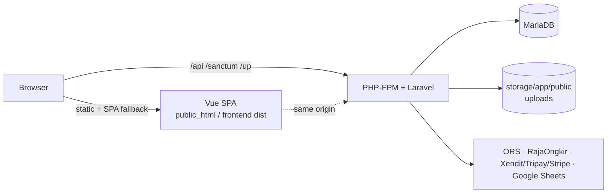
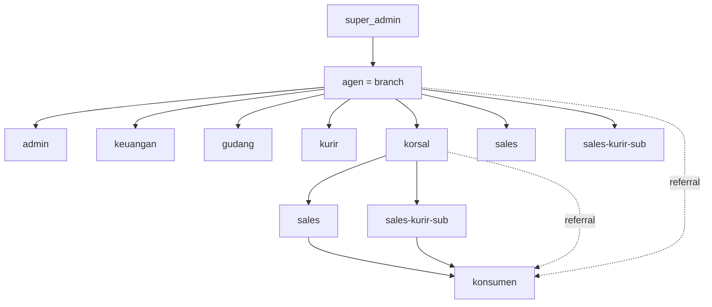

# Prime Classy — Master System Description

Canonical, high-level description of the Prime Classy website **as implemented today**. Source code wins over this document; if you find a mismatch, fix the document (see [AGENTS.md](../AGENTS.md)). Normative rules are in [BUSINESS-RULES.md](BUSINESS-RULES.md); technical detail is in [ARCHITECTURE.md](ARCHITECTURE.md); runbooks are in [OPERATIONS.md](OPERATIONS.md).

---

## 1. System identity and purpose

Prime Classy Cake & Cookies is a **multi-branch cake and cookies ordering platform**. A single Super Admin oversees the platform; each **Agen** (Agent) owns a branch with its own staff, stock, warehouse, delivery operation and payment/shipping configuration. Consumers (**konsumen**) browse a shared catalog and are attributed to a branch through a referral chain (Agen → Korsal → Sales / Sales-Kurir-Sub → konsumen). Orders are fulfilled by the branch from Agent warehouse stock or, for eligible Sales-Kurir-Sub orders, from that user's own Sub Location stock.

## 2. Current implementation status

| Area | Status |
|---|---|
| Core platform (auth, hierarchy, catalog, checkout, orders, payment, shipping, returns, commissions, reports, CMS, Sheets, installer) | Implemented, in production |
| Warehouse layer (buckets, transfers, handovers, opname, stock requests, fulfilment proposals, cancellation/return reversal) | Implemented, in production |
| **Package A** — Sales-Kurir-Sub role, 1:1 Sub Location ownership, real Sub stock, Sub replenishment/return | **Production closed** |
| **Package B** — R-03 fulfilment/delivery lifecycle (self-delivery, delivery verification, split/reschedule, delivery grouping) + R-04 authority, operational-vs-financial projections, Admin Product CRU-no-Delete, reports | **Production closed** |
| **Package C** — SC-03: Admin-only add of a new product line to an existing order | Implemented, independently reviewed, remediated and finally audited on branch `feat/package-c-sc03`; DEV UAT = Human PASS; DEV Stage Gate = CLOSED/APPROVED; deployed to production, but **Human Production UAT FAILED**. Rounds 1–3 were independently reviewed and each returned **BLOCKED**. Round-4 (final) remediation on branch `fix/package-c-production-uat` implements the Human-approved delivery-date rule (Ekspedisi `rajaongkir` dates fixed; Kurir Online `openroute` paid fees redistributed evenly across active delivery-date groups), the complete shipping-quote signature (courier/service), the historical quantity-immutability gate and the complete replay response graph. Full backend suite + frontend green; **pending one final independent review** before a new production stage gate (**not production closed**) |

## 3. Technology stack

- **Backend:** PHP 8.2+ (DEV 8.3), Laravel 11.56, Sanctum SPA sessions, MariaDB 10.11 (DEV and production), HTMLPurifier (CMS/product HTML sanitizing), PhpSpreadsheet (XLSX), `google/auth` (Sheets).
- **Frontend:** Vue 3, Vite 8, TypeScript, Pinia, Vue Router, vue-i18n, Tailwind CSS 4, CKEditor 5, Axios.
- **Integrations:** OpenRouteService, RajaOngkir/Komerce V2, Xendit/Tripay/Stripe, Google Sheets API, optional Google Maps (public key, frontend only).
- **Tests:** PHPUnit Feature/Unit against an isolated MariaDB database (`primeclassy_testing`) with a real two-connection concurrency harness. No frontend test framework.

## 4. Application topology

Frontend and backend are separate deployables that run **same-origin** in DEV and production (single-domain layout). In production the web server routes `/api`, `/sanctum` and `/up` to Laravel through `public_html/laravel.php`; everything else is the SPA with history-mode fallback. See [OPERATIONS.md](OPERATIONS.md).

## 5. User and role hierarchy

Exactly **10 roles** (rows in `roles`, no custom roles): `super_admin`, `agen`, `korsal`, `sales`, `sales-kurir-sub`, `konsumen`, `admin`, `keuangan`, `kurir`, `gudang`. The former role `sales-kurir` was **renamed in place** to `sales-kurir-sub`; there is no 11th role, and the legacy slug is only a compatibility alias.

Creation matrix (single source `HierarchyRules`): `super_admin` → `agen`; `agen` → `korsal`, `sales`, `admin`, `keuangan`, `kurir`, `gudang`, `sales-kurir-sub`; `korsal` → `sales`, `sales-kurir-sub`. Konsumen self-register (a referral code is optional; without one they are linked to an Agent later). Agent isolation is enforced in layers (route role gate, `BelongsToAgentScope` global scope, policies, services). Full authority matrix: [BUSINESS-RULES.md](BUSINESS-RULES.md#2-role-and-authority-matrix).

## 6. Authentication

Laravel Sanctum **SPA cookie** sessions with CSRF (no bearer tokens, nothing in localStorage). Login and registration are rate-limited. Every non-installer request passes `auth:sanctum` and `agent.linked` (non-super-admin users must be linked to an Agent). Role gating uses `EnsureRole` (`role:...`) and per-record Policies. The frontend `PermissionMap` capabilities are UI hints only. Cross-origin setups additionally need `FRONTEND_URLS` and `SANCTUM_STATEFUL_DOMAINS`.

## 7. Catalog and products

Global catalog (products carry no `agent_id`); only stock is per-Agent. Products with or without variations; **one global SKU namespace** (`catalog_skus`) shared by simple products and variations; categories; multiple images; per-product/variation fees (agent / sales / courier). Create/read/update is open to Super Admin, Agen and Admin; **delete is Super Admin / Agen only** (Admin has no delete). Product descriptions are sanitized. Category management is Super Admin only. Prices and fees are always resolved server-side.

## 8. Customer and referral model

Agen, Korsal, Sales and Sales-Kurir-Sub own a unique `referral_code` (prefixes `AG-`, `KO-`, `SA-`, `SS-`); konsumen, admin, keuangan, kurir and gudang do not. Historical `SA-` / `SK-` codes stay valid and are never rewritten (conversion keeps the existing code). A konsumen's referral chain (`sales_id`/`korsal_id`/`agent_id`) is snapshotted at registration and only changes through an explicit, audited reassignment (`ReferralReassignmentService`). A buyer who is themself an Agen/Korsal/Sales/Sales-Kurir-Sub can self-purchase; their account role never changes.

## 9. Checkout

`POST /checkout/quote` and `/checkout/courier-options` price a cart without side effects; `POST /orders` creates the order (requires an `Idempotency-Key`). Only product, variation and quantity come from the client — price, fees, SKU, weight, shipping and stock are resolved server-side. Delivery date is per item (`requested_delivery_date`, defaulting to the order's estimate). Shipping methods: **Kurir Online** (OpenRouteService road distance), **Ekspedisi** (RajaOngkir/Komerce V2; restricted to Manual Bank Transfer) and **Pickup** (Rp 0). Payment methods: COD, manual bank transfer, DP (down payment), Xendit, Tripay, Stripe (availability governed by global and per-Agent toggles). Checkout is throttled.

## 10. Orders

Statuses: `diterima → diproses → dikirim → terkirim → pengembalian → kembali`, plus `dibatalkan` (from `diterima`/`diproses`). COD orders start at `diproses`; all others start at `diterima` and may enter `diproses` only when payment is verified (paid, or DP partially paid). Each item has its own status mirroring the order's; shipments follow **Order + requested delivery date** (items sharing a date share one shipment). Every order and item stores immutable snapshots (product name, variation label, SKU, unit price, fees, address, recipient). Cancellation: COD while `diterima`/`diproses`; non-COD while `diterima` only. Cancelling releases reservations (and reverses shipped warehouse stock where applicable) exactly once.

## 11. Existing-order adjustments

Admin/Agen/Super Admin can: adjust an item's fulfilled quantity (only while the order is `diproses`), reschedule an item's delivery date (a partial quantity creates a new split item with its own shipment and lineage), and process returns. Quantity changes recompute the order total through `OrderTotalCalculator`; refunds and additional payments arise only from real money movement, never from a price/quantity change alone. A pending obligation freezes further increases/reductions on that item until it is settled. A delivery-date reschedule is governed by ONE canonical server-side shipping classifier: Ekspedisi (`rajaongkir`) and Pickup are denied 422 before mutation; Kurir Online (`openroute`) keeps `shipping_fee_amount` unchanged and redistributes it evenly (exact integer rupiah) across active delivery-date groups; Free (`free`) must stay zero (inconsistent nonzero fails closed); any null/unknown/mixed provider code fails closed. See [BUSINESS-RULES.md §21](BUSINESS-RULES.md#21-existing-order-adjustments).

## 12. SC-03 add-line (Package C)

`POST /orders/{order}/items` lets an **Admin only** (same Agent) add a **new** product/variation line to an existing order that is `diproses`. Server-authoritative price/fees/snapshot (shared with checkout); **Agent stock only** (Sub-sourced orders are rejected); the line joins the order's mutable shipment for its delivery date (or gets one); the order's one Stock Request gains one item (and is re-opened if it had been fully fulfilled); agent + sales commissions are recorded like checkout; order totals and payment status are reconciled canonically — a fully paid order gets exactly one pending additional payment, otherwise the remaining balance grows. A required `Idempotency-Key` plus an immutable request fingerprint makes replays safe. The response is the freshly persisted `OrderResource`. Rules: [BUSINESS-RULES.md §22](BUSINESS-RULES.md#22-sc-03--add-line-to-an-existing-order).

## 13. Payment

Payment truth is **Order-level**: `orders.total_amount`, `dp_amount`, `paid_amount`, `remaining_amount`, `payment_status`, written only by `OrderTotalCalculator` (totals) and `PaymentService` (money). `PaymentSummaryService` is the single canonical verified-payment summary read by Order Detail, reports and Sheets. A pending/rejected DP claim is sourced from the initial `down_payment` transaction plus its verification record and is shown separately for review; it never increments `paid_amount`, `verified_dp` or reduces `remaining_amount`. Flows: COD (photo proof + Finance confirmation), manual bank transfer (proof + Finance verification), DP (partial payment + separate settlement), gateways (signature-verified, idempotent webhooks). Payment verification, shipment/delivery and delivery verification are three separate concerns.

## 14. Fulfilment

After an order reaches `diproses`, Gudang can open its operational order detail (without payment ledger or financial projections) and propose fulfillment quantity/date changes. A pending proposal does not change canonical state. Admin reviews CURRENT versus PROPOSED values and approves or rejects; approval revalidates and applies through canonical fulfillment/reschedule services, while rejection and stale conflicts leave the order unchanged. Legacy Stock Request tables remain as internal demand/history accounting and are not a user-facing workflow. See [BUSINESS-RULES.md §10](BUSINESS-RULES.md#10-reservation-and-stock-movement-lifecycle-locked) and [BUSINESS-RULES.md §16](BUSINESS-RULES.md#16-warehouse-fulfillment-approval).

## 15. Shipment

Shipments are grouped by **Order + requested delivery date** (`order_items.shipment_id`; the canonical resolver is `ShipmentGroupingService`): items on the same date share one shipment and one resi; one order spans several shipments/couriers only when dates differ or a shipment is already committed. A shipment is `standard` (Kurir workflow) or `self_sub` (the owning Sales-Kurir-Sub). Office roles assign couriers; a Kurir may self-claim an unassigned `diproses` shipment, then marks it picked up and delivered **with photo proof**. A thermal receipt (58/80 mm, read-only, audited) is printed per shipment, and a consumer PDF invoice is generated for exactly one Order + requested-delivery-date group. Neither PDF creates a payment ledger; group payment allocation beyond initial DP on the earliest date remains Order-level. Shipment provider data (route, rate, ETD, weight) is an immutable snapshot.

## 16. Delivery and self-delivery

Sub-sourced items are delivered only by the owning Sales-Kurir-Sub (`self_sub`, no Courier profile, never assignable to another courier); the Sub reservation is consumed only when that owner ships. After delivery the **Admin** records an append-only **delivery verification** (`received` / `not_received` / `return`) with a mandatory `Idempotency-Key`; the latest row is the current outcome. Delivery grouping is derived: `Order + requested_delivery_date`.

## 17. Returns

Konsumen request a return per `terkirim` item (photo evidence) → Kurir pickup/confirmation → Admin/Agen review → **Gudang inspects** received quantity (good/damaged) → Admin finalizes → good units re-enter Transit (or the original Sub Location for Sub-sourced items); damaged units stay non-sellable. Refund status is handled by Finance and follows real overpayment only.

## 18. Commission

Fees are per unit × quantity, snapshotted into `order_items`. `agent` and `sales` commission rows are written at order creation (and for SC-03 lines); the `courier` commission row is written per item when it is delivered (`terkirim`). Sales and courier ledgers are never merged, even when the same Sales-Kurir-Sub earns both. Fee visibility is role-restricted.

## 19. Inventory architecture

Three coexisting representations, all Agent-scoped: legacy `product_stocks` / `product_variation_stocks` (`quantity_on_hand`, `quantity_reserved`), the warehouse bucket table `warehouse_stocks` (`transit`, `factory_plan`, `shipping`, `sub`), and Sub reservations (`sub_stock_reservations`). Warehouse mode is authoritative: the legacy manual `POST /stock/adjust` is locked (`WAREHOUSE_STOCK_AUTHORITATIVE`, default true), and `SellableStockService` is the single sellable formula. A target with no warehouse rows falls back to legacy `on_hand − reserved`.

## 20. Agent stock

Agent Sellable = **Transit + active Factory Plan − Agent Reserved**. Orders reserve at creation (physical unchanged); approval of a fulfilment proposal moves Transit → Shipping and releases the reservation; Sub quantities are never subtracted from Agent sellable again.

## 21. Warehouse stock

Buckets: `transit` (factory receipts), `factory_plan` (committed/planned supply, usable only while the Admin toggle `factory_plan_enabled` is on, not assumed physical), `shipping` (picked, ready to ship; changes only by approved fulfilment, cancellation or return reversal), `sub` (per Sub Location). `sales` is derived and never stored. Gudang cannot edit stock directly: it **requests** (stock addition, Sub adjustment, transfer, opname) and Admin approves.

## 22. Sub Location stock

`warehouse_sub_locations` with 1:1 ownership by a Sales-Kurir-Sub (`owner_user_id` UNIQUE). Sub Sellable = **Sub Physical − Sub Reserved**. Sub stock is usable only per the server-side `StockSourceResolver`. A Sub's physical stock cannot drop below its active reservations.

## 23. Stock reservation

Agent: `quantity_reserved` on the stock row (reserve at order creation / increase; release on cancel/reduce/approved fulfilment). Sub: one `sub_stock_reservations` row per order item (`active` → `consumed` at `dikirim` by the owner, or `released`). Reservation never reduces physical stock; shipment consumes physical stock plus reservation; pre-shipment cancellation releases the reservation.

## 24. Legacy Stock Request data

Three different things share the name "request" — keep them apart:
- **Order Stock Request** (`stock_requests`): retained per order for internal demand/reservation accounting and historical compatibility; it is not exposed as a user-facing workflow.
- **Warehouse stock-addition request** (`warehouse_stock_requests`): Gudang asks to add stock to Transit/Factory Plan or adjust a Sub balance; Admin approves.
- **Sub stock request** (`sub_stock_requests`): Sales-Kurir-Sub asks to replenish (Transit→Sub) or return (Sub→Transit); see §28.

## 25. Transfers

`stock_transfers` (Gudang creates `pending`; **Admin approves** → completed with paired movements and a handover). Allowed: Transit ↔ Sub and Sub ↔ Sub (non-owned Sub Locations only) and Factory Plan → Transit (admin-approved plan transfer). Shipping is closed to transfers. Owned Sub Locations move only through Sub stock requests.

## 26. Handovers

Each completed transfer produces one `stock_handovers` document (A4 browser print, read-only reprint with audit). Sub replenishment handovers are closed when the Sales-Kurir-Sub confirms **receive**.

## 27. Opname

`stock_opnames`: `physical_opname` (Transit / Shipping / Sub counts) and `plan_reconciliation`; sellable is a read-only diagnostic. **Gudang counts and submits; Admin approves/rejects** (stale snapshots conflict, approval idempotent). Reservations are preserved; a genuine shortage surfaces as a commitment deficit.

## 28. Sales-Kurir-Sub

A Sales-Kurir-Sub is Sales (referral code `SS-`, sales fee) plus owner-deliverer (own Sub Location, `self_sub` delivery, courier fee on deliveries). It may buy for itself or for its own referred consumers using Sub stock; a referred consumer's own checkout uses Agent stock. Flow: **replenish** request → Admin approve → Gudang execute (Transit→Sub, handover) → Sub receive; **return** request → Admin approve → Gudang execute (Sub→Transit, handover). Only the owning Agent converts an existing Sales into a Sales-Kurir-Sub.

## 29. Reporting

Operational transaction report (one row per `order_item`, 14 canonical columns), per-order finance report (`finance-orders`, `PaymentSummaryService`-backed), payment status, finance and network summaries, fee reports, roster/customer reports, dashboard summary, plus XLSX export. Reports are scoped by role/Agent in the backend; actor names are resolved live from stable IDs (no historical name snapshots). Gudang and Kurir never receive financial fields.

## 30. CMS

Super Admin manages homepage blocks, articles and pages (CKEditor 5, server-side HTML sanitizing), the media library, languages, website settings and the public Agent contact directory.

## 31. Integrations

- **OpenRouteService** — Kurir Online price from route distance: `max(0, distance_km − minimum_distance_km) × rate_per_km` (floored by `minimum_charge`); provider failure rejects the order (no straight-line/free fallback).
- **RajaOngkir/Komerce V2** — expedition rates; per-Agent encrypted key and origin; selection re-verified at order creation.
- **Payment gateways** — Xendit, Tripay, Stripe; credentials per Agent, stored encrypted, never returned by the API; webhooks signature-verified and idempotent.
- **Google Sheets** — one-way export of 15 whitelisted datasets, central service account, manual sync (≤ 10,000 rows), sanitized logs; never imports.
- Super Admin holds global provider toggles; Agents hold their own credentials and rules.

## 32. API

Single file `backend/routes/api_v1.php`, prefix `/api/v1`, JSON envelope `{success, message, data, errors, meta}`. Public (catalog, CMS read, referral lookup, regions, webhooks, installer pre-lock) and authenticated (Sanctum + role/policy) route groups. Errors: 422 validation/business rule, 403 authority, 404 out-of-scope resource, 409 idempotency conflict.

## 33. Frontend

Vue SPA with route guards (`requiresAuth`, `guestOnly`, role meta, installer guard), Pinia stores (auth, cart, wishlist, locale, site, ui, install), one API module per resource under `src/api`, a role-aware dashboard shell (`DashboardLayout` + `navConfig`), storefront layout, auth layout, print views, dark mode, four locales. The language switcher is mounted in the storefront header and auth layout (not in the dashboard header). The UI mirrors backend permissions for convenience only.

## 34. Database and domain overview

About 118 migrations / 80 models. Domains: identity & hierarchy (`users`, `roles`, `user_closures`, `agent_profiles`) · catalog (`products`, `product_variations`, `catalog_skus`, fees, images, categories) · orders (`orders`, `order_items`, `order_item_adjustments`, `shipments`, `delivery_verifications`, `couriers`) · payment (`payment_transactions`, `bank_transfer_verifications`, `cod_payment_proofs`, `order_additional_payments`, gateway/agent configs, `payment_webhook_logs`) · returns · commissions · warehouse (`warehouse_stocks`, `warehouse_settings`, `stock_movements`, transfers, handovers, opnames, `stock_requests*`, `warehouse_stock_requests`, `warehouse_sub_locations`, `sub_stock_*`, `inventory_cancellation_reversals`) · CMS/media/settings/languages · regions · Sheets · audit (`activity_logs`). Migrations are the schema source of truth (`backend/database.sql` is a stale export, not authoritative).

## 35. Security

Layered isolation (route role → global scope → policy → service); server-authoritative prices, fees, stock source and totals; credentials encrypted in the database and never echoed; real MIME checks and generated filenames for uploads; HTML sanitizing for CMS/product content; rate limiting on login, registration, checkout, webhooks, Sheets; signature-verified webhooks; `APP_DEBUG=false` in production; no secrets in source or `.env.example`.

## 36. Audit logging

`ActivityLogger` writes `activity_logs` (actor, subject, event, sanitized properties, IP, user agent) for user/referral, payment, order, fulfilment, shipment/return, stock, settings and master changes (including `order_item.added`). Secret-looking keys are redacted. Super Admin can browse the log. Framework diagnostics stay in `storage/logs`.

## 37. Idempotency

`Idempotency-Key` header: order creation (unique per konsumen), delivery verification (unique per verifier; replay only for identical content, else 409), Sub stock request creation (unique per requester), **SC-03 add-line** (unique per order + immutable request fingerprint), warehouse fulfilment/approval operations (persisted operation keys). Payment webhooks are idempotent per `(payment_method_id, event_id)`. The frontend generates one key per logical submission via `secureUuid()` and keeps it across retries; SC-03 additionally persists the unresolved submission (key + payload) so dismissing and reopening the form cannot create a second logical addition.

## 38. Concurrency

Row locks with fixed lock orders prevent oversell and deadlock: Order → (Stock Request) → Agent inventory targets in canonical order; Sub: location → Sub stock → reservations; checkout takes a shared Sub-location lock. Reserve/consume/release are idempotent per item. A real two-connection harness (`tests/Support/ConcurrencyHarness.php` + `.phpunit-concurrency-actor.php`) proves the critical races. Details: [ARCHITECTURE.md](ARCHITECTURE.md#7-locking-and-deadlock-prevention).

## 39. Deployment

Production is single-domain on Nginx/PHP-FPM with the `public_html/laravel.php` bridge, MariaDB 10.11, a separate production `.env`, and deploys by whitelist with maintenance mode and a mandatory backup. **`laravel.php` must survive every frontend deployment.** DEV serves `frontend/dist` and proxies `/api` to the backend on port 8080. See [OPERATIONS.md](OPERATIONS.md).

## 40. Testing

PHPUnit (`tests/Feature`, `tests/Unit`) with real DB, policy, migration, and concurrency tests; `RefreshDatabase` or the committed-fixture `RestoresIsolatedTestDatabase` trait for races. Last recorded full backend run (Package C production-UAT round-4 remediation): **936 passed / 6775 assertions / 0 failures** (includes the 4 DEV reset-command tests). Frontend type-check and production build also pass. Frontend: `vue-tsc` type-check and Vite build; no frontend test runner.

## 41. Current roadmap state

- Package A: **closed and deployed** (production batch with migrations `2026_09_29_*`).
- Package B (R-03 + R-04): **closed and deployed** (migrations `2026_10_01_100000–100002`; frontend deploy incident led to the `laravel.php` invariant).
- Package C (SC-03): **implemented**, reviewed, remediated and deployed to production (migrations `2026_10_02_100000` / `2026_10_02_110000` applied), but **Human Production UAT FAILED**. Round-1 production-UAT remediation (on `fix/package-c-production-uat`): shipment/resi grouping by **Order + requested delivery date**, per-product (proposal-line) Admin approval/rejection with order demand preserved, Stock Request quantity reconciliation, consumer delivery plan; adds migration `2026_10_03_100000_add_item_decision_to_stock_request_proposal_items` (not yet on production). Independent reviews of that remediation returned **BLOCKED**: rounds 1–3 (F01–F06, then F02 conflicting quote snapshots / F04 historical content / F07 stale replay response). Round-2 (one canonical **Order-first** lock discipline; approval re-reads demand under lock; tracking/resi = committed; committed shipment is never re-dated; shipping-fee snapshot conservation; `shipments:regroup` returns non-zero on failure), round-3 (conflicting nonzero shipping-fee carriers **fail closed** — including `provider_meta` courier/service; historical shipment *content* immutable for full reschedule and partial split; approval **replay** returns the current committed decision graph) and round-4 (Human-approved **delivery-date rule** — Ekspedisi dates fixed, Kurir Online paid fees redistributed evenly across active delivery-date groups; historical **quantity** immutability; complete replay response graph incl. `OrderItem`) are complete with the full backend suite and frontend green. **Package C is NOT production closed**; it needs one final independent review, DEV re-test and a new Human stage gate.
- After Package C is production closed, the approved feature roadmap is **complete**. No further package is authorized or planned in this repository; a new package needs an explicit Human change request.
- Documented, **unauthorized** backlog (implement only on Human request or a concrete defect): warehouse transfer/opname list `variation.label` serialization; language switcher in the dashboard header; frontend automated tests; performance audit; dead `StockService::deduct*`; unreachable `ProductTranslation.description` write path; Laravel 11 framework advisories (upgrade decision); Google Sheets destination sharing and RajaOngkir key rotation (operational).
