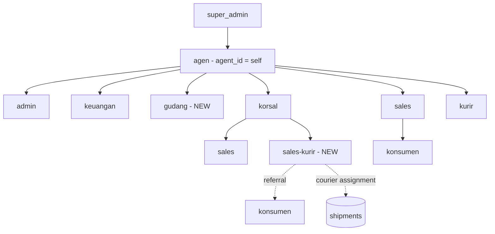
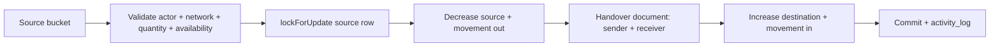
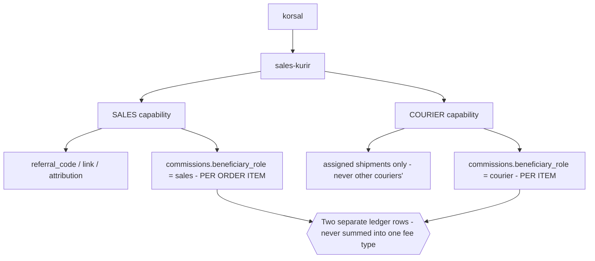
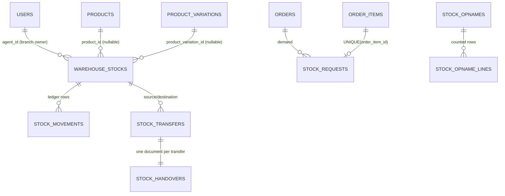
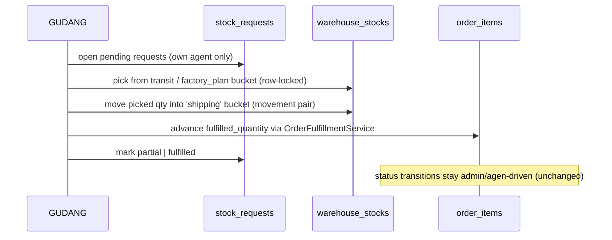

# Warehouse (Gudang) + Sales-Kurir — Specification & Architecture Proposal

**Status: SPECIFICATION ONLY — NOT IMPLEMENTED.**
No production code, migration, role, or database row was created or modified to produce
this document. Every statement about "current" behaviour below is derived from the
repository as it stands at commit `6d54f6b` (`main` == `origin/main`), read during this
specification pass.

| | |
|---|---|
| Feature | `GUDANG` (warehouse) as an Agent-network actor + `SALES-KURIR` (combined sales/courier) role |
| Type | Major business-flow + inventory-architecture change |
| Audit baseline | commit `6d54f6b`, 87 migrations, 45 Feature test files, 511 test methods |
| Deliverable | this document (single consolidated spec — see §1.1) |
| Phase | Audit → gap analysis → proposed architecture → **STOP for human review** |

> **Revision 2026-09-17 — Human decisions incorporated.** All previously open Warehouse and Sales-Kurir decisions are now resolved. This document is ready to become the implementation baseline, subject to normal phase-by-phase coding, migration, test, security, and human stage gates.

---

## 1. Executive Summary

Prime Classy today has **one** inventory dimension per agent branch: a single stock row per
product (or per variation) carrying `quantity_on_hand` and `quantity_reserved`. There is
**no warehouse concept anywhere in the codebase** — `grep -rin 'gudang\|warehouse'` over
`app/ routes/ lang/` returns zero rows. Manual stock correction is currently an
**agen/admin** privilege (`POST /api/v1/stock/adjust`, `role:agen,admin`,
`ProductStockPolicy::adjust`), and there is **no handover document, no stock opname, no
stock request, no per-stock-type ledger, and no transfer between stock buckets**. The
catalog is global (products carry no `agent_id`); only *stock* is agent-scoped.

This proposal introduces a **warehouse inventory layer** that sits *on top of* — not
instead of — the existing `product_stocks` / `product_variation_stocks` /
`stock_movements` tables, and hands the "manual stock" capability to a new
Agent-network role `gudang` while Agent/Admin keep catalog ownership. It also specifies a
new `sales-kurir` role whose RBAC is the *intersection-scoped union* of the existing
`sales` and `kurir` capabilities (never a blanket union), and re-confirms the existing
**per-item courier fee** and **multi-courier order** rules unchanged.

Three audit findings drive the design and must be read before anything else:

1. **Reservation-only lifecycle.** Orders *reserve* stock at creation
   (`StockService::reserveForProduct/Variation` at `OrderService::priceAndReserveLine`)
   and *release* it on cancellation / fulfilment reduction. **`deductProduct()` and
   `deductVariation()` are dead code — nothing in the repository ever calls them**
   (`grep -rn 'deductProduct\|deductVariation'` → only the two definitions). So today
   `quantity_on_hand` never decreases because of a sale, and `quantity_reserved` never
   converts into a real deduction. Any warehouse design must decide *where* the physical
   "goods left the warehouse" event lives (see §7, §13, OD-WH-003).
2. **"Website stock" today = `availableQuantity() = quantity_on_hand - quantity_reserved`**
   (`ProductStock`/`ProductVariationStock`), surfaced to the catalog as
   `agent_available_quantity`. That is the *only* existing "sellable" semantic — the
   warehouse's `STOK PENJUALAN` must therefore map onto this formula, not replace it
   (§6, §12).
3. **Commissions already model a per-item courier fee** (`commissions.order_item_id` +
   `beneficiary_role='courier'`, written on delivery by
   `CourierService::recordCommissionsForItems`, idempotent). Sales-Kurir must reuse that
   ledger exactly; a second, combined ledger is explicitly out of scope (§25).

Everything else — the role matrix, the 5 stock buckets, transfers, handovers, opname,
stock requests, fulfilment, migration and test plan — is specified in §5–§42, with the
genuinely undecidable business questions isolated in §40.

### 1.1 Documentation convention used here

`docs/` in this repository holds **one topic per file** (`OPENROUTESERVICE-AUDIT.md`,
`GOOGLE-SHEETS-INTEGRATION.md`, `ORDER-TRANSACTION-REPORT-AUDIT.md`, …), while
`README.md` / `BLUEPRINT.md` are written to describe **the codebase as it actually
exists today** ("This document reflects the codebase as it actually exists today. It does
not describe a hypothetical future."). Because nothing in this change is implemented yet:

- The 11 required documents are consolidated into **this single file** as sections, per the
  instruction "if project convention prefers one consolidated document, use that
  convention. Do not create unnecessary duplicate docs."
- `README.md`, `BLUEPRINT.md`, `backend/FINAL_AUDIT_REPORT.md` and `backend/SECURITY_AUDIT.md`
  were **deliberately not edited** — editing them would state that unbuilt behaviour
  exists, which is exactly the doc-drift those files are written to prevent. They must be
  updated **when the feature ships**, per §41's phase gates.

| Required document (requirement #64) | Covered by section |
|---|---|
| Warehouse Feature Specification | §1, §3, §5, §14–§15 |
| Warehouse Stock Architecture | §5–§13, §30 |
| Warehouse Business Rules | §3, §6–§13, §20, §42 |
| Warehouse RBAC | §17–§19, §32 |
| Warehouse Workflows | §8–§15, §27 (diagrams in §4, §9, §11) |
| Warehouse Database Proposal | §30 |
| Warehouse Migration Plan | §31 |
| Warehouse Security | §32 |
| Warehouse Test Plan | §36 |
| Sales-Courier Role Specification | §21–§26 |
| Changelog / Change Impact | §39 (regression impact) + §41 (phases) |

---

## 2. Current Architecture Audit (as-built, with evidence)

### 2.1 Platform baseline

| Aspect | Actual |
|---|---|
| Backend | Laravel 11.56.1, PHP 8.2+, Sanctum SPA-cookie auth, MySQL 8.4.11 |
| Frontend | Vue 3 + TypeScript + Pinia + vue-router + vue-i18n (4 locales id/en/ar/zh) + Tailwind 4, Vite build |
| API surface | one file, `backend/routes/api_v1.php` |
| Response envelope | `{success, message, data, errors, meta}` via `ApiResponse` |
| Audit trail | `activity_logs` written through `ActivityLogger::log($causerId, $subject, $event, $description, $properties)` — never a raw insert; secret keys auto-redacted; `ip_address`/`user_agent` captured server-side |
| Tests | 45 Feature files + `tests/Unit`, **511 declared test methods**, MySQL test DB, `RefreshDatabase` |
| Migrations | 87 files; `backend/database.sql` is a generated export, never hand-edited |

### 2.2 Roles & hierarchy (current)

Roles are **rows** in `roles` (`RoleSeeder`: `super_admin`, `agen`, `korsal`, `sales`,
`konsumen`, `admin`, `keuangan`, `kurir` = 8). There is no `gudang` and no `sales-kurir`.

`users` hierarchy columns (`2026_09_05_090001_add_hierarchy_columns_to_users_table.php`):
`role_id`, `parent_id` (adjacency-list upline), `agent_id` (denormalised branch owner),
`korsal_id`, `sales_id`, `referral_code` (unique), `status enum(active,inactive,suspended)`,
`softDeletes`. An `agen` self-references `agent_id = id` so branch scopes include it.
`user_closures(ancestor_id, descendant_id, depth)` is a derived O(1) index maintained only
by `HierarchyService::attachClosures/reattachSubtree`.

**Creation matrix — single source of truth `app/Support/HierarchyRules.php`:**

```php
ALLOWED_CREATIONS = [
    'super_admin' => ['agen'],
    'agen'        => ['korsal', 'sales', 'admin', 'keuangan', 'kurir'],
    'korsal'      => ['sales'],
];
ROLES_WITH_REFERRAL_CODE  = ['agen', 'korsal', 'sales'];
ROLES_REQUIRING_AGENT_LINK = ['korsal','sales','konsumen','admin','keuangan','kurir'];
```

Enforced in three places that all read the same constant: `UserManagementService::create`
(throws 403), `UserPolicy::create`, and the frontend capability hint — plus
`PermissionMap::forRole()` which auto-derives `users.create.{role}` from the same array.
`UserManagementService` additionally: forces `agent_id` from the *authenticated* actor
(client-supplied `agent_id` for another branch → 422), requires a same-branch `korsal_id`
when an **agen creates a sales** (`resolveRequiredKorsalUnderAgent`), links
`parent_id`/`agent_id`/`korsal_id` per branch of a `match(true)`, and **auto-creates a
`couriers` profile row** (`type='internal'`, `is_active=true`) whenever a `kurir` is created.

**Capabilities — `app/Support/PermissionMap.php`** (explicitly *not* a security boundary;
re-checked server-side by middleware/policy):

| Role | Stock-related capabilities | Notes |
|---|---|---|
| `super_admin` | — (no `stock.*` at all) | may **browse** stock via `?agent_id=`, cannot mutate |
| `agen` | `stock.view.own`, `stock.manage` | full branch stock rights today |
| `admin` | `stock.view.own`, `stock.manage` | same as agen for stock |
| `korsal` / `sales` | — | no stock capability |
| `keuangan` | — | finance-only capability set |
| `kurir` | — | `orders.view.assigned`, `orders.manage.shipment` |
| all of `super_admin`,`agen`,`admin` | `sheets.manage` added | Google Sheets |

Route-level gate used everywhere: `EnsureRole` middleware (`->middleware('role:agen,admin')`),
plus `EnsureAgentLinked` (`agent.linked`) guarding every non-super-admin actor.

### 2.3 Inventory / stock (current, authoritative)

Three tables, all **agent-scoped**, all keyed to the *global* catalog:

```sql
product_stocks            (agent_id FK users, product_id FK products,            quantity_on_hand uint, quantity_reserved uint, UNIQUE(agent_id, product_id))
product_variation_stocks  (agent_id FK users, product_variation_id FK variations, quantity_on_hand uint, quantity_reserved uint, UNIQUE(agent_id, product_variation_id))
stock_movements           (agent_id, product_id XOR product_variation_id [DB CHECK chk_stock_movements_target],
                           type ENUM(in,out,reserve,release,adjustment,transfer_in,transfer_out,return_restock),
                           quantity INT signed, reference_type varchar(50), reference_id, note varchar(255),
                           created_by nullable FK users, created_at only)
```

- **Unsigned columns** mean negative `on_hand`/`reserved` is impossible at DB level
  ("stock tidak boleh negatif" is enforced twice: unsigned + an explicit service guard).
- `quantity_available` shown everywhere is a **computed accessor**:
  `ProductStock::availableQuantity() = quantity_on_hand - quantity_reserved` (no `max(0,…)`).
- The catalog resolves it per-request for the *consuming* agent
  (`ProductController`: `agent_available_quantity`) and the frontend renders it through
  `StockBadge` (`loginToView` / `outOfStock` / `stockCount`).
- `agent_stocks` naming appears **nowhere** in the code (the docblock in `StockService`
  mentioning "agent_stocks" is stale wording; the real tables are the two above).

**The one writer — `app/Services/Stock/StockService.php`** (no other class touches these
columns; it never opens its own transaction for reserve/release, by design, so it composes
inside `OrderService`'s transaction):

| Method | Effect | Movement written | Called from |
|---|---|---|---|
| `reserveForProduct` / `reserveForVariation` | `reserved += qty`, guard `available >= qty` (row-locked) | `reserve`, `quantity = +qty` | `OrderService::priceAndReserveLine` (order creation), `OrderFulfillmentService::increaseFulfillment` |
| `deductProduct` / `deductVariation` | `on_hand -= qty` **and** `reserved -= qty` | `out`, `quantity = -qty` | **nowhere — dead code** |
| `releaseProduct` / `releaseVariation` | `reserved -= qty`, guard `reserved >= qty` | `release`, `quantity = -qty` | `OrderService::cancel`, `OrderFulfillmentService::reduceFulfillment` |
| `adjustProduct` / `adjustVariation` | `on_hand += delta` (creates the row at 0 if absent), guard result `>= 0` | `adjustment`, `quantity = delta`, `note = reason` | `StockController::adjust`, `ReturnService::restockItem` (`note='return_restock'`) |

**Actual stock lifecycle today (verified end-to-end):**

| Trigger | Code path | Stock effect |
|---|---|---|
| Order created (any payment method: COD / DP / transfer / gateway) | `OrderService::createOrder` → `priceAndReserveLine` | `reserved += qty`, movement `reserve` ref `('order', order_id)` |
| Quote/preview only (`/checkout/quote`) | `OrderService::quote` → `quoteLine` | none (read-only; insufficient stock only produces a *warning*) |
| Order cancelled | `OrderService::cancel` (COD: `diterima`/`diproses`; non-COD: `diterima` only) | `reserved -= remaining`, movement `release` ref `('order', order_id)` |
| Fulfilment quantity reduced | `OrderFulfillmentService::reduceFulfillment` | `reserved -= reduced`, movement `release` ref `('order_item_adjustment', item_id)` |
| Fulfilment quantity increased | `OrderFulfillmentService::increaseFulfillment` | `reserved += added` (guard available), movement `reserve` ref `('order_item_adjustment', item_id)` |
| Return approved + goods received | `ReturnService::restockItem` | `on_hand += qty` via `adjust*`, movement type **`adjustment`** with `note='return_restock'` |
| Manual correction (restock / opname / initial stock) | `StockController::adjust` | `on_hand += delta`, movement `adjustment` + `activity_logs` `stock.changed` |

**Movement types never written by the application:** `in`, `out`, `transfer_in`,
`transfer_out`. (`out` only by the dead `deduct*`; `in`/`transfer_*` are reserved for future
use — the only other place they appear is the reset command's `ResetTransactions`
classification list.) This matters: a warehouse ledger cannot assume a "goods arrived" or
"goods shipped" movement already exists.

**Consequences that any warehouse design must respect**

1. Because `deduct*` is never called, a sale **never reduces `quantity_on_hand`**; it only
   reduces *availability* via `reserved`. Returns, by contrast, *increase* `on_hand`. A
   long-running instance therefore accumulates `reserved` without a matching physical
   outflow — which is exactly the gap the warehouse "shipping stock / fulfilment" layer is
   meant to make explicit (§13, §15, OD-WH-003).
2. `return_restock` is **not** a distinct movement type in the DB enum — it is an
   `adjustment` row distinguished only by its `note` string. Any warehouse reporting that
   needs to separate "returned goods" from "operator correction" must not rely on
   `note` matching.
3. Stock mutations are only prevented from going negative; there is **no upper bound**, no
   approval step, and no required reason at the DB layer (the API requires `reason`, the DB
   does not).

### 2.4 Catalog, SKU and product ownership (current)

- `products` has **no `agent_id`** — the catalog is global. Catalog write is gated by
  `role:super_admin,agen` **only** (`routes/api_v1.php` product/variation group) and
  `ProductPolicy::manage()` returns `isRole('super_admin','agen')`. **`admin` cannot create or
  edit products today** — this directly conflicts with the new requirement that Admin also
  owns product/variant creation. **Human revision explicitly changes this: Admin will gain same-agent Product/Variation CRUD while remaining unable to mutate stock manually (RESOLVED OD-WH-009).**
- `products.has_variations` decides which stock table applies; the simple path rejects a stock
  adjustment when `has_variations` is true (`messages.product.stock_uses_variation`).
- SKU: `products.sku` (simple) / `product_variations.sku` (variation), one global namespace
  (`catalog_skus`, `GlobalSkuTest`), copied into `order_items.sku_snapshot` at order time.
  Warehouse must **reuse** this SKU, never mint a warehouse-local one (§16, §26).
- Fees: `product_fees` / `product_variation_fees` with
  `beneficiary_role ENUM('agent','sales','courier')`, one row per (target, role), written only
  by `FeeService::setForProduct/setForVariation`, read by `resolveForLine`, and snapshotted
  **per unit** into `order_items.agent_fee_amount / sales_fee_amount / courier_fee_amount`
  (multiplied by quantity at order time). Fee **write** routes are `role:super_admin,agen`.

### 2.5 Order, order item (current)

**Order** (`orders`): `order_no` (unique), `idempotency_key` (unique per konsumen),
`konsumen_id`, `sales_id`, `korsal_id`, `agent_id`, `payment_method_id`, `source_address_id`,
`status ENUM(diterima,diproses,dikirim,terkirim,dibatalkan,pengembalian,kembali)`,
`payment_status ENUM(unpaid,pending_verification,paid,partially_refunded,refunded,failed)`,
`subtotal_amount`, `discount_amount`, `shipping_fee_amount`, `admin_fee_amount`,
`dp_amount`, `paid_amount`, `remaining_amount`, `total_amount`, region + coords snapshots,
`delivery_date_estimate/actual`, `cancelled_at/by/reason`, `notes`. Global scope
`BelongsToAgentScope`. Transitions are a hard state machine in `Order::TRANSITIONS`.

**OrderItem** (`order_items`): `order_id`, `product_id`, `product_variation_id`,
`shipment_id`, `additional_payment_id`, snapshots (`product_name_snapshot`,
`variation_label_snapshot`, `sku_snapshot`, `unit_price_snapshot`, `subtotal_snapshot`,
`agent_fee_amount`, `sales_fee_amount`, `courier_fee_amount`), quantities
(`original_quantity`, `fulfilled_quantity`, `cancelled_quantity`, `returned_quantity`,
`refund_quantity`, `additional_quantity`), `status` mirroring the order state machine,
`requested_delivery_date`. `fulfilled_quantity` is the *active/billed* quantity:
`OrderTotalCalculator` recomputes `Order.total_amount` as
`SUM(unit_price_snapshot * fulfilled_quantity) + shipping + admin - discount` on every
adjustment.

### 2.6 Shipment, courier, fee ledger (current)

**Shipment** (`shipments`): now **multiple per order** (`order_id` indexed, not unique),
`courier_id` → `couriers`, `shipping_provider_id`, origin/destination coords, `distance_km`,
`shipping_fee_snapshot`, `tracking_number`,
`status ENUM(pending,picked_up,in_transit,delivered,failed)`, `shipped_at`, `delivered_at`,
`proof_media_id`. Item↔shipment linkage is `order_items.shipment_id`;
`OrderFulfillmentService::splitShipmentIfShared` splits a shipment and reassigns the item when
an adjustment would otherwise mix couriers; `assignFreshShipment` gives a rescheduled split
item its own shipment. Thermal per-shipment receipts (`pre_pickup`/`post_pickup`) are
read-only and audit-logged (`ShipmentPolicy::printReceipt`, `activity_logs`
`shipment.receipt_printed`).

**Courier**: `couriers(type ENUM(internal,external), user_id nullable, agent_id nullable,
external_code, name, is_active)` — created automatically for role `kurir` (`type='internal'`);
`CourierService` handles assignment (`assignCourier` validates same-agent), self-claim
(`selfAssignIfUnassigned`), status flips with proof upload, and order-status recomputation.
Courier dashboards are `role:kurir` only (`/kurir/orders`, `/kurir/returns`, return
pickup/confirm, delivered report), all resolved from `$actor->courierProfile`.

**Commissions (the fee ledger)**: `commissions(order_id, order_item_id nullable,
beneficiary_user_id, beneficiary_role ENUM(agent,sales,courier), amount,
status ENUM(pending,approved,paid,reversed), earned_at, paid_at)`.
- `agent` + `sales` rows are written **at order creation**
  (`OrderService::recordCommission`, one row per item per role, `order_item_id` set).
  `sales` beneficiary = `$konsumen->sales_id ?? korsal_id ?? agentId`, except self-purchase
  cases where the konsumen is itself an internal role (`SelfPurchaseAndFeeAttributionTest`).
- `courier` rows are written **on delivery, per item**
  (`CourierService::recordCommissionsForItems`), idempotent via
  `where(order_item_id, beneficiary_role='courier')->exists()`, skipped when
  `courier_fee_amount <= 0`, and skipped when the shipment has no `courier.user_id`.
  → **the courier fee is per item, not per order, and a multi-courier order already credits
  each item's own shipment courier.** This is existing, tested behaviour that Sales-Kurir must
  not change (§25, §26).

### 2.7 Shipping, payment, returns (context the warehouse must not break)

- Shipping: OpenRoute (internal courier, distance-priced) or RajaOngkir/Komerce (expedition),
  per-agent credentials; `AvailablePaymentMethodService` restricts **expedition → Manual Bank
  Transfer only**; **Pickup** is a third method quoting Rp0 with no provider row.
- Payment: COD (proof + admin confirm), manual transfer (proof + keuangan verify), DP (partial
  + separate settlement), 3 gateways with signature-verified idempotent webhooks.
  `PaymentSummaryService` is the single payment-summary source (`grand_total`, `verified_dp`,
  `total_paid`, `remaining_balance`, `overpaid_amount`, `additional_payment_*`, `refund_*`).
- Returns: konsumen files a return per item (photo proof) → courier pickup/confirm → admin
  approve; approval + receipt triggers `restockItem`. Refund is driven by **actual
  overpayment**, never by the mere fact that a quantity dropped.

### 2.8 Reporting, exports and Google Sheets (current)

- `ReportService` (14 entry points): `transactions`, `salesKorsalFees`,
  `cancellationsRefunds`, `courierFees`, `agentFees`, `paymentStatus`, `financeSummary`,
  `couriersPerAgent`, `customersReport`, `korsalReport`, `salesReport`, `courierReport`,
  `dashboardSummary`, `networkSummary`, `salesCustomersReport`, plus Excel export via
  `App\Services\Export`. Every report scopes by actor role/agent, and
  `OrderTransactionReportService` is the canonical **item-level** column set shared by the
  order-transaction report and two Google Sheets datasets.
- Google Sheets: `sheets_configs` / `sheets_destinations` / `sheets_sync_logs`;
  `GoogleSheets\DatasetRegistry::definitions()` currently whitelists **15 dataset keys**
  (`products`, `stock`, `transactions`, `transaction_items`, `sales`, `korsal`,
  `courier_deliveries`, `sales_fees`, `korsal_fees`, `courier_fees`, `payment_status`,
  `refunds`, `additional_payments`, `transaction_report`, `financial_summary`), each with an
  **explicit column list** — no arbitrary table/column passthrough. `SyncService` is
  server-side, manual, one-way (**no Sheets→MySQL path**), 10k-row capped,
  concurrency-locked, and logs success/failure. MySQL remains the source of truth.

### 2.9 Test coverage relevant to this change (current)

45 Feature files / 511 declared test methods. Directly relevant existing coverage:

| Area | Existing tests |
|---|---|
| Stock isolation / permission | `ProductSystemTest` (`stock_for_the_same_product_variation_is_isolated_per_agent_and_never_summed`, `stock_can_never_be_adjusted_below_zero`, `agen_cannot_adjust_another_agents_stock`, `sales_and_konsumen_cannot_adjust_stock_at_all`, `super_admin_cannot_adjust_stock_but_can_still_browse_it`, `admin_can_still_adjust_stock_within_their_own_agent`, `product_with_variation_rejects_stock_adjustment_on_the_parent_product`) |
| Reservation / cancellation | `CancellationRulesTest::test_cancelling_releases_reserved_stock`, `OrderTest::test_order_is_rejected_when_stock_is_insufficient`, `CheckoutTest::test_quote_warns_on_insufficient_stock_without_blocking_the_request` |
| Cross-branch isolation | `CrossAgentIsolationTest`, `OrderTest::test_two_agents_stock_for_the_same_product_never_mix` |
| Fulfilment | `OrderFulfillmentTest` (39+ methods incl. insufficient-stock rejection, shipment preservation, refund/additional-payment ledgers) |
| Courier & fees | `CourierSystemTest` (34), `FeeSystemTest` (10), `SelfPurchaseAndFeeAttributionTest` (24), `ReportSystemTest` |
| RBAC / hierarchy | `UserManagementTest` (13), `PermissionMapTest`, `KeuanganRoleTest`, `CrossAgentIsolationTest` |
| Sheets / receipts | `GoogleSheetsTest`, `ShipmentReceiptPrintTest` |

### 2.10 Gap summary (what does not exist today)

| # | Gap | Severity |
|---|---|---|
| G1 | No warehouse/gudang role, entity, or concept anywhere in code | HIGH |
| G2 | No stock buckets: one `on_hand`/`reserved` pair per product/variation per agent — no transit/sub/plan/sales/shipping separation | HIGH |
| G3 | Manual stock mutation sits with **agen/admin**; must move to Gudang | HIGH |
| G4 | No transfer between stock buckets → no atomicity/concurrency design for it | HIGH |
| G5 | No handover (serah terima) document, no print, no sender/receiver modelling | HIGH |
| G6 | No stock opname (system vs physical, difference, reason, approval) | HIGH |
| G7 | No stock request / no order→warehouse demand queue; fulfilment is an admin quantity edit, not a warehouse pick/pack flow | HIGH |
| G8 | No "ready to ship" physical state distinct from `order_items.status` | MEDIUM |
| G9 | No factory-plan feature toggle of any kind | MEDIUM |
| G10 | Admin cannot create products/variations (route + policy say `super_admin,agen`) — conflicts with the new requirement | MEDIUM (business-rule change) |
| G11 | `deduct*` dead code — a sale never physically reduces `on_hand` | HIGH (must be resolved before shipping-stock design) |
| G12 | No `sales-kurir` role; a combined sales+courier identity is impossible without granting blanket `sales` + `kurir` | MEDIUM |
| G13 | No Sales→Sales-Kurir conversion action of any kind | MEDIUM |
| G14 | No warehouse datasets in the Google Sheets registry | LOW |
| G15 | No warehouse reports (stock by type, movements, transfers, opname, requests, handovers) | MEDIUM |

### 2.11 Impact ratings (audit output required by the brief)

| Dimension | Rating | Why |
|---|---|---|
| **Database impact** | **HIGH** | New tables (warehouse stock, movements, transfers, handovers, opname, stock requests, plan toggle) + at least one new dimension on `stock_movements` (a stock *type*) + backfill of existing rows. Altering `stock_movements` (a live ledger, with a DB CHECK constraint and an enum) is a DDL change, not a new-table-only change. |
| **Migration risk** | **HIGH** | Existing `quantity_on_hand` carries **no provenance** — nothing in the data says whether a unit is "transit", "plan pabrik" or something else, because only one bucket has ever existed. Any mapping is a business decision, not a data-derivable one (RESOLVED OD-WH-006). `quantity_reserved` additionally over-states reservations relative to any physical outflow because `deduct*` never runs (OD-WH-003). |
| **Security impact** | **HIGH** | Introduces a new privileged inventory writer and *removes* a capability two roles hold today (agen/admin). Requires new policies, new route gates, cross-network IDOR tests for every new endpoint, and hard guard rails so Gudang can never touch price/identity/payment/fee. |

---

## 3. Business Requirements (normalised, with repository-aligned wording)

Requirements are restated in the repository's own vocabulary so later phases trace 1:1 to
tests. "REQ" IDs are this document's own (the brief's section numbers are in parentheses).

| REQ | Requirement (as specified) | Repository-aligned statement |
|---|---|---|
| REQ-01 | New role `GUDANG` inside an Agent network; Agent can create it (brief §2, §43) | `roles` + `HierarchyRules::ALLOWED_CREATIONS['agen'][] += 'gudang'`; `agent_id` always set (branch), `parent_id = agent`, no `korsal_id`, **no referral code** |
| REQ-02 | Gudang scope = own agent network only (brief §2, §24) | Every endpoint resolves `agent_id` from `$actor->agent_id` (never client input) — same pattern as `StockController::resolveViewedAgentId` |
| REQ-03 | Gudang cannot create/edit Product or Variation (brief §3, §32) | Catalog routes/policies unchanged for gudang (deny); gudang gets read-only catalog access |
| REQ-04 | Agent + Admin keep product/variant CRUD; **neither may change stock manually** (brief §4, §32) | `POST /stock/adjust` re-gated to `role:gudang`; agen/admin keep `stock.view.own` only |
| REQ-05 | Five warehouse stock buckets: Transit, Sub, Plan Pabrik, Penjualan, Pengiriman (brief §5) | One normalised stock table keyed by (agent, product\|variation, stock_type) — never 5 columns on `products` |
| REQ-06 | Transit = goods in from factory, traceable (brief §6) | Movement type `FACTORY_IN` + reference + actor + timestamp; no silent edit |
| REQ-07 | Sub = stock recorded at an external branch/sub-location without website transaction (brief §7) | **RESOLVED OD-WH-001:** Sub is a **stock branch/location without login**, not a user role and not a child Agent. It does **not reduce or alter main sellable stock automatically**; it records the quantity known to exist at that sub-location for visibility/audit. No authentication, hierarchy node, referral, commission, or checkout authority is created for Sub. |
| REQ-08 | Plan Pabrik bucket with an ACTIVE/INACTIVE toggle owned by ADMIN (brief §8, §33) | `warehouse_settings.factory_plan_enabled` (per agent); **ADMIN only** may enable/disable it. Agen/Super Admin may view/audit but do not receive toggle authority unless a future requirement changes this. Gudang is read-only on the flag. **RESOLVED OD-WH-007.** |
| REQ-09 | Penjualan = what the website sells; formula Transit + (ACTIVE ? Plan : 0) (brief §9) | `sales_available = transit + (factory_plan_enabled ? factory_plan : 0) - reserved`; derived and never directly editable. Reservation continues to reduce sellable stock. At warehouse fulfilment, the fulfilled quantity is moved out of the physical source bucket into `shipping` and the matching reservation is released in the same transaction, so sellable quantity does not jump or double-count. **RESOLVED OD-WH-003/008.** |
| REQ-10 | Shipping bucket = ready-to-ship goods; two workflows: Stock Request + Fulfillment (brief §11–§13) | `stock_requests` (from order items) + warehouse fulfilment moving stock into the `shipping` bucket |
| REQ-11 | Stock Request traceable to order + item, no duplicates on refresh (brief §12) | **RESOLVED OD-WH-002:** create the Stock Request when the order first enters status **`diproses`**. The transition handler must be idempotent; repeated saves/webhooks/status refreshes must not create duplicate requests. |
| REQ-12 | Every stock change has a movement/ledger entry; no silent edit (brief §15–§16) | Extend the existing `stock_movements` ledger with a stock-type dimension + new types; append-only convention |
| REQ-13 | Every inter-bucket move has a handover (serah terima) form (brief §17–§19) | `stock_handovers` with document number, sender/receiver user + name snapshot, printable, reprint read-only |
| REQ-14 | Atomic transfers + concurrency safety (brief §20–§21) | `DB::transaction` + `lockForUpdate()` on the source row before decrement — same discipline as `StockService::reserve*` |
| REQ-15 | Stock opname for every applicable bucket (brief §22–§23) | `stock_opnames` + `stock_opname_lines` producing `OPNAME_ADJUSTMENT` movements for **physical stored buckets**. `factory_plan` uses plan reconciliation (not a physical count) and derived `sales` uses sellable reconciliation only; neither is directly overwritten. **RESOLVED OD-WH-008.** |
| REQ-16 | Gudang performs fulfilment; partial fulfilment is allowed (brief §13) | **RESOLVED OD-WH-004:** if requested qty = 10 and Gudang can fulfil 6, fulfil 6 now and keep **4 pending** on the same stock request/item. `OrderFulfillmentService` remains the canonical writer for fulfilment quantities; warehouse fulfilment must be idempotent and may never exceed requested/remaining quantity. |
| REQ-17 | New role `SALES-KURIR` under KORSAL; created by Agent (with KORSAL chosen) or Korsal (under self) (brief §34–§35, §43) | `HierarchyRules::ALLOWED_CREATIONS['agen'][] + ['korsal'][] += 'sales-kurir'`; `agent_id`/`korsal_id`/`parent_id` per the existing `match(true)` branches; auto-create a `couriers` row like `kurir` |
| REQ-18 | Only AGENT may convert an existing SALES → SALES-KURIR (brief §36) | New endpoint with an explicit conversion matrix. **Only the Agent that owns the same network may perform the conversion**; Korsal/Admin/Super Admin are denied. Target Sales must belong to the actor's Agent network and already have a valid same-network Korsal relationship. **RESOLVED OD-WH-010.** |
| REQ-19 | Sales-Kurir keeps Sales capability: referral code/link/attribution + Sales Fee (brief §37–§38) | `ROLES_WITH_REFERRAL_CODE[] += 'sales-kurir'`; use an explicit referral-prefix map with **`SK-`** for Sales-Kurir so it does not collide semantically with Sales `SA-`. **RESOLVED OD-WH-011.** |
| REQ-20 | Sales-Kurir carries Courier capability: assigned shipments, pickup/delivery, courier fee **per item** (brief §39–§41, §59–§60) | Reuse the `couriers` profile + `CourierService` + `/kurir/*` routes; `commissions` stays split by `beneficiary_role` |
| REQ-21 | Ledgers stay separate: sales fee ≠ courier fee (brief §39) | No new combined ledger; Sales-Kurir simply appears as beneficiary in **both** existing `beneficiary_role` rows |
| REQ-22 | Sales-Kurir access stays scoped (never a blanket union) (brief §42) | `orders.view.assigned` for the courier side + sales referral scope for the sales side; never `orders.view.network` blindly |
| REQ-23 | Backend is the only security boundary; UI hiding is not (brief §24, §33, §44) | Policies + `role:` middleware + `agent_id` scoping on every new route; `PermissionMap` stays hints only |
| REQ-24 | Reuse Policies/Permissions/Scopes/Services over scattered `if role === 'gudang'` (brief §44) | New `WarehousePolicy`, `StockRequestPolicy`, `HandoverPolicy`, `OpnamePolicy`; role strings live only inside those |
| REQ-25 | Warehouse affects reports + Sheets without breaking finance reports (brief §45–§47) | New read-only report endpoints + new whitelisted Sheets datasets; a Sheets failure must never roll back an inventory transaction |

---

## 4. Domain Model

### 4.1 Network (target, extends today's tree)



`gudang` hangs directly off `agen` (like `admin`/`keuangan`/`kurir`), **never** under `korsal`.
`sales-kurir` hangs under `korsal` exactly like `sales`. Both new roles are `agent_id`-linked
and therefore covered by `EnsureAgentLinked`.

### 4.2 Warehouse flow (refined to this repository's actual semantics)

```mermaid
graph TD
  F[PABRIK / factory] -->|FACTORY_IN| T[TRANSIT stock]
  T -->|TRANSFER + HANDOVER| S[SUB stock]
  ADM[admin toggles feature] --> P[PLAN PABRIK stock]
  T --> SEL{{SELLABLE = TRANSIT + (plan_active ? PLAN : 0) - RESERVED}}
  P --> SEL
  SEL --> WEB[Website / catalog agent_available_quantity]
  WEB --> ORD[Order + OrderItem - reserve]
  ORD --> PROC[Order enters diproses]
  PROC --> SR[STOCK REQUEST]
  SR --> GDF[Gudang fulfilment]
  GDF --> SHP[SHIPPING stock - ready to ship]
  SHP --> LOG[Logistics: Shipment / Courier assignment]
  LOG --> DEL[Delivery / Pickup + thermal receipt]
  LOG --> RET[Return / failed delivery]
  RET -. RESOLVED OD-WH-005 decides which bucket .-> T
```

**Important:** the `- RESERVED` term is not decoration. Today `availableQuantity()` is
`on_hand - reserved`, and the catalog already shows that number. Dropping reservations would
change the meaning of every existing number on the storefront (§7, OD-WH-003).

### 4.3 Transfer + handover



### 4.4 Sales-Kurir capability split



---

## 5. Warehouse Stock Types (5 buckets)

### 5.1 Naming convention

The repository uses `snake_case` English table/column names, keeping Indonesian vocabulary in
statuses (`diterima`, `diproses`, …) and UI labels. Stock *types* are not user-facing statuses,
so English snake_case codes + Indonesian i18n labels:

| Brief name | Proposed code | Indonesian label | Nature |
|---|---|---|---|
| STOK GUDANG TRANSIT | `transit` | Stok Gudang Transit | **stored bucket** (physical goods received from factory) |
| STOK GUDANG SUB | `sub` | Stok Gudang Sub | **recording/location bucket** for stock known to exist at a sub-branch/location without login. It is informational/operational and does **not automatically reduce main sellable stock**. **RESOLVED OD-WH-001.** |
| STOK GUDANG PLAN PABRIK | `factory_plan` | Stok Gudang Plan Pabrik | **stored planning bucket / committed supply**, writable only while ACTIVE; it may contribute to sellable stock but is **not assumed to be physically present in the warehouse** |
| STOK GUDANG PENJUALAN | `sales` | Stok Gudang Penjualan | **derived/calculated** — never independently editable (OD-WH-003) |
| STOK GUDANG PENGIRIMAN | `shipping` | Stok Gudang Pengiriman | **stored bucket** (picked/packed, ready to ship) |

### 5.2 Why not five columns on `products`

1. `products` is **global** (no `agent_id`); stock is per-agent. Columns on `products` cannot
   express "Agent A transit 10 / Agent B transit 4" without duplicating catalog rows.
2. Variations need the same five buckets; `products` columns cannot cover
   `product_variation_stocks` without a parallel column set.
3. The existing ledger (`stock_movements`) is keyed by agent + target, not by bucket. With
   buckets as columns, no movement could say *which bucket* it moved.
4. `quantity_on_hand`/`quantity_reserved` are `unsigned` + guarded; five new columns would need
   five more guards, policies, and report joins.

### 5.3 Proposed shape (normalised, additive)



`warehouse_stocks(agent_id, product_id XOR product_variation_id, stock_type, quantity,
UNIQUE(agent_id, product_id, product_variation_id, stock_type))` with
`stock_type ENUM(transit, sub, factory_plan, shipping)` — `sales` is **deliberately absent** because it is derived (§7). `factory_plan` is a planning/committed-supply bucket, not proof of physical possession. Materialising `sales` later is rejected by default; any future cache/materialisation requires a reconciliation mechanism and profiling evidence.

### 5.4 Relationship to the existing tables (compatibility, not replacement)

`product_stocks` / `product_variation_stocks` remain the **storefront-facing projection** for
Phases B–H, because `availableQuantity()` is read in `ProductController`,
`OrderService::quoteLine`, `OrderFulfillmentService` and every stock test. The warehouse layer
feeds them; it does not delete them. During compatibility phases, `quantity_on_hand` becomes a **legacy sellable-base projection** maintained by the system rather than an independently edited number. It must not be interpreted as a pure physical-stock total once `factory_plan` is allowed to contribute to sellable supply. Phase H moves storefront/checkout reads to the canonical warehouse sellable service; the legacy projection remains only for backward compatibility until safely retired.

## 6. Inventory Source of Truth

### 6.1 Source-of-truth matrix (proposed)

| Quantity | Source of truth | Writable by | Notes |
|---|---|---|---|
| Transit bucket | `warehouse_stocks(stock_type=transit)` | gudang (via movements only) | factory intake, transfers out |
| Sub bucket | `warehouse_stocks(stock_type=sub)` | gudang (via controlled record/adjustment flow) | branch/location record without login; not part of main sellable formula unless a future business rule explicitly changes this |
| Plan Pabrik bucket | `warehouse_stocks(stock_type=factory_plan)` | gudang **only if** `factory_plan_enabled` | ADMIN owns the toggle; this is committed/planned supply, not automatically physical stock |
| Shipping bucket | `warehouse_stocks(stock_type=shipping)` | gudang (via fulfilment/transfer) | boundary with logistics (§27) |
| Sales bucket (sellable) | **derived formula** (§7) | nobody (422 if attempted) | must equal what the storefront shows |
| `product_stocks.quantity_on_hand` | legacy sellable-base projection during migration | system only | compatibility value; reconcile to `transit + active_factory_plan`, **not** to physical-stock total |
| `product_stocks.quantity_reserved` | order reservations (unchanged) | system only (`StockService`) | existing behaviour preserved |
| Fee / price / payment | **unchanged, out of warehouse scope** | existing roles only | gudang can never reach it |

### 6.2 Invariants (each becomes a test in §36)

| ID | Invariant |
|---|---|
| INV-01 | All stock quantities are integers `>= 0` at DB level (existing unsigned convention; new buckets follow it) |
| INV-02 | A warehouse stock row belongs to exactly one agent branch; its product/variation is resolved within that same branch context |
| INV-03 | A movement has exactly one target (`product_id` XOR `product_variation_id`) — mirror of the existing `chk_stock_movements_target` CHECK |
| INV-04 | A movement quantity is never `0`; transfer quantities are always `> 0` |
| INV-05 | `source_stock_type <> destination_stock_type` for every transfer |
| INV-06 | The derived `sales` quantity is never directly writable (manual write ⇒ 422) |
| INV-07 | No write into `factory_plan` while the toggle is INACTIVE (including system paths, except an admin-approved migration backfill) |
| INV-08 | Every transfer has exactly one handover document; a handover never exists without its transfer |
| INV-09 | Fulfilment never exceeds the authorized stock request and never exceeds available bucket stock |
| INV-10 | The **legacy sellable-base projection** reconciles to `transit + (factory_plan_enabled ? factory_plan : 0)` during compatibility phases; it is not a physical-stock total |
| INV-11 | A physical unit moved to `shipping` is removed from its physical source bucket in the same transaction; the same unit must never be counted in both source and `shipping` |
| INV-12 | Warehouse fulfilment releases the matching reservation only for the quantity actually moved to `shipping`; source decrement + shipping increment + reservation release are atomic/idempotent |
| INV-13 | Physical inventory reconciliation excludes `factory_plan`; physical stock is the sum of applicable physical stored buckets (for example `transit + shipping + sub` once Sub is defined) |
| INV-14 | A courier-fee commission row stays **per `order_item_id`**, never merged into a per-order row |
| INV-15 | Sales fee and courier fee never share one ledger row; `beneficiary_role` remains the discriminator |
| INV-16 | Reprint of any handover/receipt document performs zero stock/status writes (print audit logging is allowed) |
| INV-17 | Cancellation/return releases reservations and restocks/moves physical stock exactly once — no double release/restock |
| INV-18 | `sub` stock is a separate recorded location balance and **does not automatically decrement or increase main sellable stock**; any future physical transfer linkage requires an explicit approved business rule |
| INV-19 | A Stock Request is created exactly once when an order first transitions into `diproses`; repeated transition handling is idempotent |
| INV-20 | Partial fulfilment is permitted: fulfilled quantity may be less than requested; the unfulfilled remainder stays pending and remains traceable |
| INV-21 | Cancellation before shipping returns/release quantity to sellable availability exactly once; a returned item must pass condition inspection before any restock destination is chosen |

## 7. Stock Calculation (sellable / sales stock)

### 7.1 What "website stock" means *today* (must not be silently changed)

```text
availableQuantity() = quantity_on_hand - quantity_reserved        (ProductStock / ProductVariationStock)
catalog exposes it as agent_available_quantity for the consuming agent
```

So today's storefront number is **on-hand minus reservations**, not a bare on-hand figure.
Order creation reserves immediately (`reserved += qty`) for *every* payment method, including
COD that has not been paid.

### 7.2 Approved sellable formula and fulfilment rule

**Human decision — RESOLVED OD-WH-003:** keep the existing reservation model as the oversell guard.

```text
sales_available(agent, target)
    = transit(agent, target)
    + ( factory_plan_enabled(agent) ? factory_plan(agent, target) : 0 )
    - reserved(agent, target)
```

`factory_plan` is committed/planned supply that may be sold while the feature is ACTIVE; it is not proof that the units are already physically present. Therefore physical fulfilment may consume only a physical source bucket that actually contains the goods.

Worked example:

| Step | transit | plan | plan active | reserved | shipping | storefront shows |
|---|---|---|---|---|---|---|
| Baseline | 100 | 50 | yes | 0 | 0 | **150** |
| Order for 20 arrives | 100 | 50 | yes | 20 | 0 | **130** |
| Gudang fulfils 20 from Transit | 80 | 50 | yes | 0 | 20 | **130** |
| Plan switched OFF by admin | 80 | 50 | no | 0 | 20 | **80** |

Fulfilment is an **atomic physical move**:

```text
source physical bucket -= fulfilled_qty
shipping bucket        += fulfilled_qty
reserved               -= fulfilled_qty
```

Because source and reservation decrease together, sellable stock does not jump upward during fulfilment. A physical unit must never exist simultaneously in both its source bucket and `shipping`.

If an order was accepted only because `factory_plan` contributed supply but the corresponding goods have not yet arrived physically, the stock request may remain pending/backordered; Gudang must not fabricate a physical transfer from `factory_plan` into `shipping`. Conversion of planned supply into physical stock happens only through an explicit factory-arrival/Transit movement.

Cancellation before fulfilment releases reservation only. Cancellation after fulfilment must reverse/move physical stock from `shipping` according to RESOLVED OD-WH-005; it must not release the same reservation twice.

### 7.3 Derived vs materialised (decision framing)

| Option | How | Pros | Cons | Recommendation |
|---|---|---|---|---|
| **A. Derived (computed)** | One SQL aggregate/`selectRaw` joining buckets + reservations at read time | Single source of truth; impossible to drift; no cache invalidation | Extra join on catalog/checkout hot paths; needs index discipline (§63 of the brief → §33 here) | **APPROVED DEFAULT** for `sales`; matches the repository's existing "compute, never trust the client" stance |
| **B. Materialised (stored column)** | A stored `quantity` on a `sales` bucket row kept in sync by every writer | Fast reads | Every writer must remember to update it; drift is silent and catastrophic; two sources of truth | **Not approved for initial implementation.** Revisit only with profiling evidence + reconciliation command/test |

During Phases B–G the safest hybrid is: **warehouse buckets stored; `sales` derived; and the
existing `product_stocks.quantity_on_hand` maintained as a projection** so nothing that already
reads it breaks (Phase H flips the storefront to read the derived value directly).

### 7.4 Where the derivation is enforced

- One service, `WarehouseStockService::sellableFor(agentId, product|variation)` — mirroring
  `AvailablePaymentMethodService`'s "single canonical rule, reused by every caller" pattern.
- Reused by: catalog listing/detail (`ProductController`), checkout quote
  (`OrderService::quoteLine`, which today only *warns*), order creation (hard 422 via
  `StockService`), fulfilment increase, and the new warehouse dashboard.
- Never re-implemented inline; a test must assert that the storefront number equals the
  service's number for the same (agent, target).

## 8. Stock Movement (ledger)

### 8.1 Extend, do not replace

The existing `stock_movements` table is already the right shape (append-only, signed
`quantity`, `reference_type`/`reference_id`, `created_by`, indexed by agent+target and by
reference). The warehouse adds **one dimension** (`stock_type`) and **new type values**;
both `product_id` XOR `product_variation_id` and the CHECK constraint stay untouched.

```sql
ALTER TABLE stock_movements
  ADD COLUMN stock_type ENUM('unallocated','transit','sub','factory_plan','shipping') NULL AFTER quantity,
  ADD COLUMN counterpart_stock_type ENUM('transit','sub','factory_plan','shipping') NULL AFTER stock_type,
  ADD COLUMN transfer_id BIGINT UNSIGNED NULL AFTER counterpart_stock_type,
  ADD COLUMN handover_id BIGINT UNSIGNED NULL AFTER transfer_id,
  ADD INDEX idx_sm_agent_type_target (agent_id, stock_type, product_id, product_variation_id),
  ADD INDEX idx_sm_transfer (transfer_id);

ALTER TABLE stock_movements MODIFY type ENUM(
  'in','out','reserve','release','adjustment',
  'transfer_in','transfer_out','return_restock',
  'factory_in','fulfillment','opname_adjustment','cancellation_release'
) NOT NULL;
```

`stock_type = 'unallocated'` is the explicit resting place for every **legacy row** (existing
movements predate buckets) — see §31 for why a literal `NULL` + `'unallocated'` sentinel beats
guessing a bucket during migration.

### 8.2 Movement type semantics (final vocabulary to be confirmed at Phase B)

| Type | Meaning | Sign convention | Triggered by |
|---|---|---|---|
| `factory_in` | Goods received from Pabrik into Transit | `+qty` on `transit` | Gudang (Transit intake) |
| `transfer_out` | Leaving a bucket via transfer | `-qty` on source | Transfer service |
| `transfer_in` | Arriving into a bucket via transfer | `+qty` on destination | Transfer service |
| `fulfillment` | Reserve-then-move into Shipping bucket for an order | `-qty` source, `+qty` shipping (two rows) | Gudang fulfilment from a stock request |
| `return_restock` | Returned goods re-entering a bucket | `+qty` | Return approval (bucket per RESOLVED OD-WH-005) |
| `opname_adjustment` | Physical count correction | `±qty` (delta) | Stock opname approval |
| `cancellation_release` | Bypass/return of goods previously in Shipping bucket due to cancellation | `+qty` destination | Cancellation path (per RESOLVED OD-WH-005) |
| `reserve` / `release` / `adjustment` | **unchanged existing semantics** (storefront reservations & legacy manual corrections) | as today | `StockService` (unchanged) |

**No silent edit rule (brief §16):** after Phase B, no endpoint may write
`warehouse_stocks.quantity` directly. Every mutation goes through a service that writes a
movement row in the same transaction; the API only accepts *intent* (e.g. `delta` + `reason`,
or “transfer N from transit to shipping”), never a resulting absolute number. Where an
absolute correction is genuinely needed (opname), it is stored as
`system_quantity`/`physical_quantity` **plus** the derived delta movement — never as an
overwrite.

### 8.3 Audit trail pairing

Every movement row is paired with an `activity_logs` entry
(`ActivityLogger::log($actor->id, $subject, '<domain>.<action>', $reason, $properties)`) where
`properties` carries `actor_role`, `agent_id`, `stock_type`, `source`, `destination`,
`quantity`, `reference` and before/after values — the same convention already used by
`stock.changed`, `order_item_adjustment.*` and `shipment.receipt_printed`.

## 9. Transfer (between buckets)

### 9.1 Sequence (single DB transaction, per brief §20)

```text
BEGIN
  1. authorize        WarehousePolicy::transfer (role gudang, own agent_id)
  2. validate         source ≠ destination; qty > 0 integers; product XOR variation
  3. validate toggle  destination = factory_plan ⇒ require factory_plan_enabled
  4. lock             SELECT ... FOR UPDATE on the source warehouse_stocks row
  5. check            source.quantity >= qty
  6. decrease source  + movement (transfer_out, -qty)
  7. increase dest    + movement (transfer_in, +qty)   [row created at 0 if absent]
  8. create handover  stock_handovers (+ lines) with document no, sender, receiver
  9. link             movements.transfer_id / handover_id
 10. audit            ActivityLogger::log(...)
COMMIT            -- any failure ⇒ ROLLBACK, no partial move (brief §20)
```

### 9.2 Concurrency (brief §21)

`lockForUpdate()` on the **source row** inside the transaction is the same mechanism
`StockService::reserve*` already uses for the same class of race (two concurrent orders against
a low-stock item). Two concurrent transfers of 8 from a bucket holding 10 must serialise: the
second re-reads the decremented source and fails the availability check with a 422
(`messages.stock.insufficient_column`-style message). Requirements:

- never `SELECT` then `UPDATE` without a lock (that is the classic lost-update pattern);
- `unsigned` columns remain the last line of defence (a negative DB write is impossible);
- destination row creation must be `firstOrCreate`-style inside the same transaction to avoid
  a duplicate-key race on the unique constraint;
- the transfer must be idempotent per request key (§34).

### 9.3 Failure modes to test explicitly

| Scenario | Expected |
|---|---|
| Source insufficient | 422, zero rows written (movements, transfer, handover) |
| Destination is INACTIVE Plan Pabrik | 422 (INV-07) |
| Source == destination | 422 (INV-05) |
| Cross-agent product id | 404/403 per convention (§17) |
| Two concurrent transfers | exactly one succeeds; no negative stock; source+destination sums conserved |

## 10. Handover (Form Serah Terima)

### 10.1 Table proposal

```sql
stock_handovers(
  id, agent_id FK users, document_no UNIQUE (e.g. 'ST-<agent>-YYYYMMDD-0001'),
  transfer_id FK stock_transfers UNIQUE,           -- INV-08
  source_stock_type, destination_stock_type,
  handed_by_user_id FK users, handed_by_name_snapshot,
  received_by_user_id FK users NULL, received_by_name_snapshot NULL,
  status ENUM('draft','completed') DEFAULT 'completed',
  notes TEXT NULL, completed_at, created_at, updated_at
)
stock_handover_lines(
  id, stock_handover_id FK, product_id NULL, product_variation_id NULL,
  sku_snapshot, product_name_snapshot, variation_label_snapshot,
  quantity, UNIQUE(stock_handover_id, product_id, product_variation_id)
)
```

### 10.2 Actors: user id **and** name snapshot (brief §18)

The brief is explicit: do not store only a string if existing User relationships can be used,
but historical prints must stay stable if the user is later renamed. The repository already
solves this class of problem with **snapshots** (`recipient_name_snapshot`,
`product_name_snapshot`, `sku_snapshot`, `address_snapshot`), so the handover follows the same
convention: `handed_by_user_id` **and** `handed_by_name_snapshot` (likewise for the receiver).
`received_by_user_id` is nullable because an external receiver (a sub-agent's staff member
without an account) may be legitimate — but that is exactly the open question OD-WH-001 gates.

### 10.3 Print (brief §19)

- Route mirrors the existing thermal receipt pattern: a dedicated frontend route rendering the
  document, `GET /warehouse/handovers/{handover}/receipt` returning a
  `StockHandoverResource` snapshot — **read-only**, and every print/reprint writes an
  `activity_logs` row (`stock_handover.printed`, `is_reprint` flag) exactly like
  `shipment.receipt_printed`.
- Print content: Prime Classy, agent/branch name, document number, date, source stock type,
  destination stock type, product + SKU + variation, quantity, penyerah (sender), penerima
  (receiver), status/reference.
- **No financial data** (no fee/price/commission), consistent with the thermal receipt rule.
- Reprint must never mutate stock or status (INV-13) — this is a **security test**, not just a
  UI nicety.
- Paper format: **A4 browser print is approved** for handovers (CSS `@media print`), because the form may contain many lines, sender/receiver identities, notes and signature areas. Shipment resi remains 58/80mm thermal. Reprint remains read-only apart from print audit logging. **RESOLVED OD-WH-012.**

## 11. Stock Opname

### 11.1 Scope per bucket (brief §22)

| Bucket | Opname supported? | How |
|---|---|---|
| `transit` | **Yes — physical opname** | system qty vs physical qty → delta movement |
| `sub` | **Yes — physical opname** | same once OD-WH-001 defines the physical destination/entity |
| `factory_plan` | **Plan reconciliation, not physical opname** | compare planned/committed quantity against factory plan records; no physical-count claim and no silent overwrite |
| `shipping` | **Yes — physical opname** | goods are physically picked/packed and committed to orders; negative delta raises an exception/reconciliation workflow |
| `sales` (derived) | **Derived reconciliation only** | verify formula inputs (`transit`, active `factory_plan`, `reserved`); never write `sales` directly |

**RESOLVED OD-WH-008:** the UI may keep one umbrella menu named **Stock Opname**, but the workflow must label the operation type clearly:
- `PHYSICAL_OPNAME` for physical stored buckets;
- `PLAN_RECONCILIATION` for `factory_plan`;
- `SELLABLE_RECONCILIATION` for derived `sales`.

Only physical opname can produce an `OPNAME_ADJUSTMENT` movement that changes physical quantity. Plan/sellable reconciliation may produce audit/reconciliation records and corrective actions against their authoritative inputs, never an overwrite of a derived number.

### 11.2 Tables

```sql
stock_opnames(id, agent_id, stock_type, document_no UNIQUE, status ENUM('draft','submitted','approved','rejected'),
              created_by FK users, approved_by FK users NULL, reason TEXT NULL, created_at, updated_at)
stock_opname_lines(id, stock_opname_id, product_id NULL, product_variation_id NULL,
              sku_snapshot, product_name_snapshot, system_quantity, physical_quantity,
              difference (generated or computed), note, adjustment_movement_id NULL)
```

### 11.3 Adjustment semantics (brief §23)

`physical 97 vs system 100 ⇒ difference -3` is applied **only** as an
`opname_adjustment` movement of `-3` with `reference_type='stock_opname'`,
`reference_id=<opname id>`; the bucket's stored quantity is then updated by the service the same
way every other movement updates it. Direct assignment of the absolute number into
`warehouse_stocks.quantity` is forbidden (INV/§16 rule).

Approval is now fixed: **Gudang submits → Admin approves** (`approved_by`, `approved_at`). Gudang cannot self-approve its own stock opname adjustment, and Super Admin does not become an inventory approver by default. Approval and the resulting adjustment movement must remain auditable and transactional. **RESOLVED OD-WH-013.**

### 11.4 Mobile-first opname UX (brief §56)

```text
SELECT STOCK TYPE -> SEARCH PRODUCT/SKU -> SYSTEM QTY (read) -> PHYSICAL QTY (input)
  -> DIFFERENCE (computed live) -> NOTE -> CONFIRM -> movement + audit
```

- One line at a time (mobile-friendly), with a batch/summary screen for desktop.
- Search by name/SKU using the existing catalog search capabilities.
- **Barcode/QR scanning is not an existing capability anywhere in this repository** and is listed
  as a future enhancement only (brief §56 is respected: do not invent it).
- Never a wide desktop-only table as the *only* interaction: each counted row must be reachable
  and editable on a 360px viewport.

## 12. Sales Stock (storefront-facing)

- Definition: the derived quantity in §7.2 — never a stored, directly editable number (INV-06).
- Contract with the storefront:
  - simple product → numeric stock (existing `StockBadge` `stockCount`);
  - product with variations → the **selected variation's** quantity (never the parent's);
  - `0` → the existing out-of-stock state (`outOfStock`); the product must not be buyable;
  - guest → the existing **`loginToView`** behaviour is preserved; guests do not see numeric stock. Authenticated users see stock according to the existing product visibility rules. **RESOLVED OD-WH-014.**
- Backend authority (brief §28): the frontend number is display only. Authoritative validation
  stays where it is today — **order creation** (`StockService::reserve*` inside `OrderService`'s
  transaction → `InsufficientStockException`) and **fulfilment increase**
  (`OrderFulfillmentService::increaseFulfillment`). This repository has **no server-side cart**
  (the cart is a Pinia store; `frontend/src/api/` has no cart module), so "validate on add-to-cart"
  can only mean: the storefront re-validates on every cart mutation **and** the server still
  hard-fails at order creation. Any statement that add-to-cart validates stock server-side is
  false today and must not be written into the spec as existing behaviour.
- Checkout quote behaviour must be preserved: today `quoteLine` produces only a **warning**
  (`CheckoutTest::test_quote_warns_on_insufficient_stock_without_blocking_the_request`) while order
  creation hard-fails. That asymmetry is existing, tested behaviour; making the quote hard-fail is
  a behaviour change needing its own decision + test.

## 13. Shipping Stock (ready to ship)

- Meaning: goods physically picked/packed and committed to a specific order item, waiting for the
  courier — the **handover point to logistics**.
- Boundary (brief §58): the warehouse owns inventory readiness; existing modules own movement
  (`shipments`, `couriers`, `CourierService`, assignment, pickup, status, proof, thermal resi). The
  warehouse must never write `shipments.*`, never assign couriers, never flip `order_items.status`.
- Proposed linkage: fulfilment rows carry `stock_request_id` + `order_item_id`; the movement pair
  into `shipping` uses `reference_type='order_item'`, `reference_id=<order_item id>`, so a shipment
  can later be reconciled to the goods it carries without new `shipments` columns.
- Cancellation/return **from** `shipping` (brief §30–§31): destination bucket is **undecided**
  (RESOLVED OD-WH-005). Options: (a) back to `transit`, (b) a dedicated `returns` bucket, (c) restock
  straight into the sales projection. Today's code restocks via `adjustProduct(+qty)` (the single
  `quantity_on_hand`). Until RESOLVED OD-WH-005 is answered, no phase may ship a change here.
- Thermal receipt (brief §60): unchanged — per-shipment, `pre_pickup`/`post_pickup`, read-only,
  audit-logged, and never carrying warehouse-internal financial data.

## 14. Order → Stock Request (warehouse demand)

### 14.1 What exists today

Nothing. Fulfilment is an admin/agen quantity edit on an existing `order_item`
(`OrderFulfillmentService::adjustItemQuantity`). There is no queue, no request row, and no
warehouse-side worklist.

### 14.2 Proposed model

```sql
stock_requests(
  id, agent_id, order_id FK orders, order_item_id FK order_items UNIQUE,   -- REQ-11 anti-duplicate
  product_id NULL, product_variation_id NULL,
  sku_snapshot, requested_quantity, fulfilled_quantity DEFAULT 0,
  status ENUM('pending','partial','fulfilled','cancelled') DEFAULT 'pending',
  requested_at, completed_at, created_at, updated_at
)
```

- **Anti-duplicate rule (brief §12):** keyed by a unique `order_item_id`; a repeated create (refresh,
  retry, webhook replay) is an idempotent no-op returning the existing row — the same discipline as
  the order `Idempotency-Key` and webhook-event idempotency already used in this repository.
- `requested_quantity` is snapshotted at request time; `fulfilled_quantity` advances from warehouse
  fulfilment; neither may be silently re-derived from `order_items` later.

### 14.3 When is the request created? (brief §14 — **undecided**)

| Option | Trigger | Consequence for COD / DP / gateway |
|---|---|---|
| A | Order created (`orders.status = diterima`; stock already reserved) | Warehouse picks immediately, even for a COD order that may never be delivered. Matches today's eager reservation. |
| B | Payment verified (`payment_status = paid`) or COD `diproses` | Picking only on real commitment; delays expedition/gateway flows and diverges from today's reservation timing. |
| C | Admin explicitly releases to warehouse (`diterima → diproses`) | Keeps human control; matches the existing meaning of `diproses` = "payment verified/collected" for non-COD. |

Because `diterima → diproses` **already means** "payment verified / COD confirmed" for non-COD
orders (see `OrderService::cancel`'s status rules) and COD may be cancelled while `diterima`/
`diproses`, option **C** is most consistent with existing state semantics — but this is a business
decision → **OD-WH-002 (critical)**. The chosen option must be re-checked against expedition's
Manual-Transfer-only rule and the DP settlement flow before Phase F.

## 15. Fulfillment (warehouse execution)



- **Single writer preserved:** `OrderFulfillmentService` remains the only code touching
  `order_items.fulfilled_quantity` and the refund/additional-payment ledgers. The warehouse service
  calls it (or a thin adapter); it never re-implements it. This protects the money-driven refund
  rules shipped in `66b4757`.
- **Double-counting guard:** picking must not create a *second* `reserve` on top of the order's
  existing reservation. Either fulfilment converts the existing reservation
  (`StockService::deduct*` finally becomes live — a deliberate, tested change) or it moves bucket
  stock and leaves `reserved` untouched. Choosing wrongly double-counts → **OD-WH-003 (critical)**.
  `deduct*` is currently dead code; waking it up is exactly the change that must be decided, not
  assumed.
- **Partial fulfilment** (brief §13): 6 available for a request of 10. Today the system allows a
  quantity *reduction* on an item (producing a refund only when money was already received —
  correct behaviour), so partial picking is expressible as "fulfil 6, leave 4 pending". Whether
  that is desired, or picking must be all-or-nothing → **OD-WH-004 (critical)**.
- Status vocabulary is fixed to **English lowercase snake_case**. Stock Request minimum statuses: `pending | partial | fulfilled | cancelled`. Transfer/opname-related statuses also use English snake_case consistently. **RESOLVED OD-WH-015.**
- Fulfilment must never exceed `requested_quantity - fulfilled_quantity` nor available bucket stock
  (INV-09), must be row-locked, and must write a movement (brief §15).

## 16. Product / Variant Integration

- **No `warehouse_products` table.** A warehouse stock row is a *stock dimension* on the existing
  `products` / `product_variations` — exactly as `product_stocks` already is. Duplicating the
  catalog would fork SKU ownership and break `catalog_skus`.
- Simple vs variation rule preserved: `products.has_variations = false` ⇒ stock attaches to the
  product id; `true` ⇒ stock attaches to a variation id, and a parent-level stock write is rejected
  (`messages.product.stock_uses_variation`).
- SKU (brief §26): one global namespace, reused verbatim; warehouse documents/exports carry
  `sku_snapshot` copied at document creation (handover/opname lines), never a re-derived SKU.
- Gudang may **view** products/variations (needed to pick, count, fill forms) but never
  create/update/delete them, and never change price, category, images, status, or fees (§18.3).

## 17. Agent Network Isolation

Threat (brief §24, §61): a Gudang user of Agent A sending Agent B's `product_id`, `variation_id`,
`stock_request_id`, `handover_id`, `opname_id`, or `agent_id` directly.

Rules:

1. **Never** accept `agent_id` from the client on warehouse endpoints; resolve it from
   `$actor->agent_id` — the `StockController::resolveViewedAgentId` pattern. If super_admin
   oversight is ever exposed here, it must go through the same explicit `?agent_id=` + validated
   path that stock browsing already uses.
2. Every query is scoped by `agent_id` **in the builder**, never filtered after loading. New models
   use the same `BelongsToAgentScope` global scope already applied to `Order`, `ProductStock`,
   `OrderItem`, etc.
3. Cross-network access fails **before** any write and is indistinguishable from "not found" for
   foreign ids — the repository's existing convention (see `CrossAgentIsolationTest`).
4. A policy exists for every new model (`WarehouseStockPolicy`, `StockTransferPolicy`,
   `StockHandoverPolicy`, `StockOpnamePolicy`, `StockRequestPolicy`), and each route group also
   carries a `role:` gate — defence in depth, exactly as `stock/*` does today.
5. Frontend hiding is not a control (REQ-23): §36's tests hit the API directly with foreign ids.

## 18. Gudang RBAC

### 18.1 Role definition

| Property | Value |
|---|---|
| slug | `gudang` |
| seeder | appended to `RoleSeeder` (already idempotent via `updateOrInsert`) |
| created by | `agen` only — `HierarchyRules::ALLOWED_CREATIONS['agen'][] += 'gudang'` |
| hierarchy | `parent_id = agent_id = <creating agen's id>`; `korsal_id = null`; `sales_id = null` |
| referral code | **none** — deliberately *not* added to `ROLES_WITH_REFERRAL_CODE` |
| agent link | required — added to `ROLES_REQUIRING_AGENT_LINK` (so `EnsureAgentLinked` guards it) |
| courier profile | none (not a courier) |
| new tables for the role itself | **none** — no staff-profile table is needed; `agent_profiles` is the *agent's store* profile, not a staff record |

Because `PermissionMap` derives `users.create.{role}` from `HierarchyRules`, and `UserPolicy::create`
delegates to the same class, adding one constant entry updates the enforcement, the authorization
gate and the frontend hint simultaneously (brief §44 — no scattered role-string checks).

### 18.2 Capability set (proposed additions to `PermissionMap`)

| Capability | Meaning | Routes (proposed) |
|---|---|---|
| `warehouse.view.own` | read warehouse stock + movements of own branch | `GET /warehouse/stocks`, `GET /warehouse/movements` |
| `warehouse.manage` | factory-in, transfers, handover, opname | `POST /warehouse/transfers`, `POST /warehouse/opname`, `POST /warehouse/handovers` |
| `warehouse.fulfill` | work the stock-request queue | `GET /warehouse/stock-requests`, `POST /warehouse/stock-requests/{r}/fulfill` |
| `warehouse.report.view` | warehouse reports | `GET /reports/warehouse/*` |
| `stock.view.own` (retained) | read the existing projection | `GET /stock/products`, `GET /stock/variations` |

**Removed from `agen` *and* `admin`: `stock.manage`** → they keep `stock.view.own` only. This is the
single most disruptive permission change in the proposal: it breaks
`ProductSystemTest::test_admin_can_still_adjust_stock_within_their_own_agent` and the
`agen`-adjusts-stock expectations **by design**, and those tests must be rewritten to assert the new
denial (G3; brief §4, §32).

### 18.3 Hard denials for Gudang

| Denied | Enforced by |
|---|---|
| Create/update/delete product or variation | `ProductPolicy` (unchanged) + `role:super_admin,agen` route group |
| Change price / fee / category / images / status | same policies; fee write routes stay `role:super_admin,agen` |
| Toggle Plan Pabrik | new `WarehouseSettingPolicy` (admin only — OD-WH-007) |
| Touch payment / refund / additional payment / COD / DP | `keuangan`/`admin` routes unchanged; warehouse has zero finance capability |
| Assign couriers / flip shipment status / print resi | `ShipmentPolicy` + `orders.manage.shipment` roles unchanged |
| Edit `order_items.fulfilled_quantity` directly | only through `OrderFulfillmentService` |
| Write an absolute stock number without a movement | service-level invariant (§8.2) + INV-06/INV-07 tests |
| Anything in another branch | policies + `agent_id` scoping (§17) |

## 19. Agent / Admin Permission Changes (role matrix, actual → target)

### 19.1 Stock & catalog matrix

| Capability | super_admin | agen | admin | gudang (NEW) | keuangan | korsal | sales | kurir |
|---|---|---|---|---|---|---|---|---|
| Create product | ✓ (today) | ✓ (today) | **✓ required/approved** | ✗ | ✗ | ✗ | ✗ | ✗ |
| Edit product | ✓ | ✓ | **✓ required/approved** | ✗ | ✗ | ✗ | ✗ | ✗ |
| Create/update variant | ✓ | ✓ | **✓ required/approved** | ✗ | ✗ | ✗ | ✗ | ✗ |
| View stock (own branch) | ✓ (browse only) | ✓ | ✓ | ✓ | ✗ | ✗ | ✗ | ✗ |
| **Manual stock change (adjust)** | ✗ (already denied) | **✓ today → ✗** | **✓ today → ✗** | **✓ (new)** | ✗ | ✗ | ✗ | ✗ |
| Warehouse transfer / handover | ✗ | ✗ | ✗ | ✓ | ✗ | ✗ | ✗ | ✗ |
| Stock opname | ✗ | ✗ | ✗ | ✓ (submit) · admin approves (OD-WH-013) | ✗ | ✗ | ✗ | ✗ |
| Toggle Plan Pabrik | ✗ | ✗ | **✓ ADMIN ONLY** | ✗ | ✗ | ✗ | ✗ | ✗ |
| Work stock requests / fulfil pick | ✗ | ✓ today (`orders.manage.fulfillment`) — stays for quantity *edits* | ✓ today — stays | ✓ (new pick workflow) | ✗ | ✗ | ✗ | ✗ |
| System-generated movements (reserve/release/return restock) | system | system | system | system | system | system | system | system |

Two clarifications the brief demands (§4 "jangan blokir system movements"):

- **MANUAL stock change** = an operator asserting a number (today `POST /stock/adjust`). This is
  what moves to Gudang.
- **SYSTEM-GENERATED movement** = `reserve` / `release` (order lifecycle), `return_restock`
  (return approval), and the future `fulfillment` / `opname_adjustment` / `factory_in` types.
  These keep running under whatever actor triggered the business event (agen/admin/kurir/system),
  because they are consequences of an authorized business action, not a stock edit. Blocking them
  would break cancellation and returns — explicitly out of bounds.

### 19.2 What must NOT change

`orders.manage.status`, `orders.manage.fulfillment`, `orders.cancel`,
`orders.manage.shipment`, `orders.manage.payment`, all `finance.*`, all `system.*`,
`users.view.network`, and every fee/payment/shipping route stay exactly as today. Warehouse work is
**additive** except for the two deliberate removals (`stock.manage` from agen/admin) and the
`POST /stock/adjust` role gate.

## 20. Plan Pabrik Feature Toggle

| Aspect | Proposal |
|---|---|
| Storage | `warehouse_settings(agent_id UNIQUE, factory_plan_enabled BOOLEAN DEFAULT 0, created_at, updated_at)` — a per-branch setting, mirroring how `agent_payment_method_settings` / `agent_shipping_provider_settings` already scope one row per agent |
| Default | **disabled** (safe: no new sellable quantity appears until someone turns it on) |
| Write | `PATCH /warehouse/settings/factory-plan` gated **`role:admin` only**; Agen/Super Admin get no implicit override. **RESOLVED OD-WH-007.** |
| Read | `GET /warehouse/settings` for agen/admin/gudang/super_admin (gudang needs it to know whether the bucket is open) |
| Effect on writes | Gudang may create/adjust `factory_plan` bucket rows **only while ACTIVE**; while INACTIVE every write path returns 422 (`messages.warehouse.factory_plan_disabled`) — enforced in the *service*, not only the policy |
| Effect on sales stock | `factory_plan` quantity stops counting toward `sales_available` the moment the toggle goes OFF (§7.2 worked example, row 3). The stored plan bucket is **not** zeroed — disabling hides it, it does not destroy it |
| Effect on existing orders | none — reservations are already made; a toggle must never retroactively cancel stock |
| Frontend | a toggle on the Admin's warehouse settings screen; hidden (not merely disabled) for Gudang |

Why not `settings` (global table)? `SettingSeeder` + `settings` is the *platform-wide* store
(website settings); per-branch business configuration in this repository always lives in a
dedicated `agent_*_settings` table (payment methods, shipping providers). Following that existing
pattern keeps agent scoping automatic and avoids a global flag that would leak across branches.

## 21. Sales-Kurir Role

### 21.1 Identity model (the important decision)

Brief §34 forbids creating duplicate users for one person. Two candidate implementations:

| Option | How | Verdict |
|---|---|---|
| **A. One role row `sales-kurir`** (recommended) | new slug in `roles`; `PermissionMap` gains a `sales-kurir` branch that is the *scoped union* of the two existing capability lists; `couriers` profile auto-created like `kurir` | One user, one login, one ledger identity. Matches `kurir` (which is also just a role + a `couriers` row) |
| B. Role `sales` + a boolean flag `is_kurir` | cheaper migration | Rejected: reintroduces exactly the scattered `if (role === …)` checks brief §44 forbids, and makes every policy a two-condition test |

Recommended: **Option A**, one role row `sales-kurir`. The slug uses a hyphen (never a role-name
check in controllers — always `isRole('sales-kurir')` inside a policy or capability map).

### 21.2 Capability set (scoped union, never a blanket union)

```
sales-kurir :=
    users.view.own-network-slice     (referral downline only — same rule as 'sales')
  + orders.view.network              (sales-side visibility limited to orders attributed to them)
  + orders.create
  + orders.view.assigned             (courier side — ONLY their own shipments)
  + orders.manage.shipment           (status flip on their own shipments, incl. pickup proof)
  + stock.*                          (NOTHING — no warehouse capability at all)
  + finance.* / system.*             (NOTHING)
```

Critical anti-privilege-escalation rules (brief §42, §59):

- A Sales-Kurir must **not** receive `orders.view.network` in the *full* agen/admin sense — the
  courier side is `orders.view.assigned` (shipments where `couriers.user_id = actor.id`) and the
  sales side is orders where `sales_id = actor.id`. A shipment of *another* courier returns
  403/404 exactly as `CourierService`'s existing "not your delivery" check does.
- A Sales-Kurir must **not** be assignable to another agent's shipment (`CourierService::assignCourier`
  already validates the same-agent condition; the courier-profile `agent_id` keeps that working).
- A Sales-Kurir **cannot** create Shipping Stock or run any warehouse action (§59). They receive
  items only after the existing logistics state allows it.
- Fee *visibility*: `FeeResource`/`ProductPolicy::viewFees` rules are unchanged; a Sales-Kurir sees
  their **own earned** commissions (both `sales` and `courier` rows) and nothing else, same as
  today's `sales` and `kurir`.

## 22. Sales-Kurir Hierarchy & Creation

### 22.1 Creation matrix (target)

| Creator | May create | Required input | Resolved columns |
|---|---|---|---|
| `super_admin` | `agen` only | — | unchanged (brief §43's warning: do not break "super_admin creates agen only") |
| `agen` | `korsal`, `sales`, `sales-kurir` **NEW**, `admin`, `keuangan`, `gudang` **NEW**, `kurir` | for `sales` **and** `sales-kurir`: a same-branch `korsal_id` (existing `resolveRequiredKorsalUnderAgent`) | `parent_id = korsal_id`, `agent_id = creator->agent_id`, `korsal_id = selected korsal` — the exact shape the current `sales`-by-`agen` branch already produces |
| `korsal` | `sales`, `sales-kurir` **NEW** | none (self) | `parent_id = creator->id`, `agent_id = creator->agent_id`, `korsal_id = creator->id` |

Implementation is two edits to existing structures, not new logic paths:
`HierarchyRules::ALLOWED_CREATIONS` + one new arm in `UserManagementService::create`'s
`match (true)` (reusing `resolveRequiredKorsalUnderAgent`), then `user_closures` is maintained by
the existing `HierarchyService::attachClosures` — **no bypass** (brief §35).

Additionally, like `kurir`, creating a `sales-kurir` must auto-create its `couriers` row
(`type='internal'`, `agent_id`, `is_active=true`) inside the same transaction — the same reason the
`kurir` branch exists: so an admin can never forget the step that makes the user assignable.

### 22.2 Role conversion: `sales` → `sales-kurir` (brief §36)

| Actor | Allowed? | Basis |
|---|---|---|
| `agen` | **YES** (only actor) | brief §36 states this explicitly |
| `korsal` | NO (may create, may not convert) | brief §36 |
| `admin` | NO | no existing rule grants admin any role-mutation right; `UserPolicy::update` already excludes `role_id` changes ("that's a re-parent operation, not an edit") |
| `super_admin` | ~~OD-WH-010~~ **RESOLVED** | May Super Admin convert Sales → Sales-Kurir? | Existing code had no precedent | **Decision:** NO. Conversion is allowed only to the **Agent that owns the same network**. Korsal/Admin/Super Admin cannot perform the conversion. | Preserves network ownership and avoids privilege expansion | **RESOLVED — Human 2026-09-17** |
| ~~OD-WH-011~~ **RESOLVED** | Referral-code prefix for Sales-Kurir | Existing substring logic would collide semantically with Sales `SA-` | Add an explicit role-prefix map and use **`SK-`** for new Sales-Kurir referral codes. Historical codes are not rewritten. | Clearer audit/report identity with no ledger merge | **RESOLVED — Human 2026-09-17** |
| ~~OD-WH-012~~ **RESOLVED** | Paper format for handover | Handover has multiple lines, sender/receiver identities and signature areas | **A4 browser print** for handovers. Existing shipment resi stays 58/80mm thermal. | Clear separation between warehouse document and shipping receipt | **RESOLVED — Human 2026-09-17** |
| ~~OD-WH-013~~ **RESOLVED** | Does stock opname need approval, and who approves? | Existing approval flows provide precedent | **Decision:** Gudang submits → Admin approves. Gudang cannot self-approve; Super Admin is not an inventory approver by default. | Separates counting from approval and improves audit integrity | **RESOLVED — Human 2026-09-17** |
| ~~OD-WH-014~~ **RESOLVED** | Should guests see numeric stock? | Existing storefront uses `loginToView` | **Decision:** keep current behaviour. Guests must login to see numeric stock. | Avoids an unnecessary storefront-visibility change | **RESOLVED — Human 2026-09-17** |
| ~~OD-WH-015~~ **RESOLVED** | Final status vocabulary for stock requests/transfers | Repository mixes Indonesian order states with English ledger states | **Decision:** use **English lowercase snake_case**, including `pending`, `partial`, `fulfilled`, `cancelled`. | Keeps warehouse domain enums consistent and API-friendly | **RESOLVED — Human 2026-09-17** |
| ~~OD-WH-016~~ **RESOLVED** | Can one Agent network have more than one physical warehouse? | Existing model has one branch/store identity per Agent | **Decision:** **one warehouse/bucket-set per Agent network** for this implementation. No `warehouse_id` dimension. | Keeps all inventory scoping aligned to existing `agent_id` architecture | **RESOLVED — Human 2026-09-17** |

### 40.1 What is *not* an open decision (answered by the code)

To honour "do not ask questions already answered by code", these were resolved during the audit and
are **not** up for discussion: courier fee granularity (per item — §25), multi-courier per order
(allowed and split-safe — §26), thermal receipt mode derivation + reprint read-only (§13/§27),
expedition ⇒ Manual Transfer only (§2.7), refund/additional-payment money rules (§2.7, `66b4757`),
"super_admin may not mutate stock" (`ProductSystemTest`), `product_id XOR product_variation_id`
(`chk_stock_movements_target`), snapshot-before-reference (`OrderItem` snapshots), and the
Google-Sheets one-way/manual/whitelisted model (§29).

## 41. Proposed Implementation Phases (dependency-ordered)

The brief's conceptual A–L decomposition is kept but re-sequenced against real dependencies found in
this audit. Every phase ends with the full suite green + `vue-tsc` + build + docs updated, and ships
behind no state that could leave a half-written ledger.

| Phase | Scope | Depends on | Decisions to close first |
|---|---|---|---|
| **A** | RBAC foundation only: `gudang` + `sales-kurir` role rows, intentional Admin Product/Variation CRUD grant, `HierarchyRules` (creations / referral / agent-link), explicit `SK-` referral prefix mapping, `PermissionMap`, new `UserManagementService` arms (+ auto `couriers` row), **Agent-network-only** Sales→Sales-Kurir conversion endpoint, user-management UI, `WarehouseRoleTest` + creation half of `SalesCourierTest`. **No stock behaviour change yet** | — | — |
| **B** | Inventory foundation: `warehouse_stocks`, the `stock_movements` ALTER (bucket dimension), model + global scope + policy, read endpoints, `warehouse:reconcile`; encode physical-vs-plan semantics and source→shipping non-double-count invariant; **one bucket-set per Agent network** | A | — |
| **C** | Transit intake (`factory_in`) + Plan Pabrik committed-supply bucket + **ADMIN-only** `warehouse_settings` toggle + approved derived `sales_available` service (no UI switch yet) | B | — |
| **D** | Transfers + handover + **A4 browser-print** handover document (every bucket pair **except** Sub) | C | — |
| **E** | `PHYSICAL_OPNAME` for physical buckets + `PLAN_RECONCILIATION` for factory plan + `SELLABLE_RECONCILIATION` for derived sales; Gudang submits and Admin approves; `opname_adjustment` changes physical stock only | C | — |
| **F** | Stock requests + warehouse fulfilment worklist, calling into `OrderFulfillmentService` | C, E | OD-WH-015 |
| **G** | Shipping bucket wired to logistics + cancellation reversal to sellable + return condition-inspection gate before restock | D, F | — |
| **H** | Storefront migration: catalog + checkout + `StockBadge` read the approved authoritative sellable number; legacy `quantity_on_hand` becomes compatibility-only; **guest `loginToView` preserved** | C, F | — |
| **I** | Sales-Kurir capability completion: courier dashboard reuse, scoped sales views, `SK-` referral codes, Agent-network-only conversion, per-item fee regression tests | A | — |
| **J** | Reports (§28) + Sheets datasets (§29) + exports | G, H | — |
| **K** | Production migration/backfill M1→M4: map 100% legacy on-hand to Transit within same Agent network + reconciliation sign-off | B…H | — |
| **L** | Hardening: threat-list sweep (§32), concurrency stress (§33), idempotency sweep (§34), N+1/index review, full regression, **and only here** update `README.md` / `BLUEPRINT.md` | all | — |
| **D-sub** | Sub-location stock records (no-login branch/location), opname/reporting, explicitly independent from main sellable stock | A, B | — |

Sequencing notes derived from the audit, not assumed:

- RBAC (A) precedes stock work because Phases C–G are meaningless without `role:gudang` gates, and
  because removing a capability two roles hold today deserves its own reviewable change.
- The **permission removal** (agen/admin can no longer adjust) and the **bucket authority** (Phase H)
  sit in different phases on purpose: shipping them together would leave a window where *nobody* can
  correct stock. Phases A–C keep legacy `POST /stock/adjust` alive for agen/admin until Gudang can do
  the same job; the cutover is one commit at the tail of Phase C — a deliberate deprecation window,
  not forgotten debt.
- Phase K is second-to-last: schema and code must be proven on a fresh test DB
  (`migrate:fresh --seed` + `WarehouseMigrationTest`) before any production row is touched, and
  `database.sql` must be regenerated afterwards (README §25 rule).

## 42. Acceptance Criteria

### 42.1 This specification is complete when…

| # | Criterion | Where |
|---|---|---|
| 1 | Existing inventory audited and the stock source of truth named (`product_stocks` / `product_variation_stocks` + `availableQuantity()`) | §2.3 |
| 2 | Existing order→stock lifecycle identified (reserve at creation, release at cancel/reduce, restock at return, `deduct*` dead) | §2.3 |
| 3 | Existing RBAC + agent/korsal hierarchy audited (`HierarchyRules`, `PermissionMap`, `UserPolicy`, `user_closures`) | §2.2 |
| 4 | Gudang role specified: creation, scope, capabilities, hard denials | §18 |
| 5 | Agent/Admin stock restriction specified — including what must stay allowed (system movements) | §19 |
| 6 | All five buckets specified with stored-vs-derived declared explicitly | §5, §12, §13 |
| 7 | Sales-stock derivation semantics **approved**: reservations reduce sellable; fulfilment atomically moves physical source→shipping and releases matching reservation; `sales` remains derived | §7 |
| 8 | Plan Pabrik specified as committed/planned supply; **ADMIN-only** toggle, non-destructive disable, and plan reconciliation semantics defined | §5, §11, §20 |
| 9 | Stock request trigger (`diproses`), partial fulfilment, transfer, handover, opname and print specified | §9–§15 |
| 10 | Network isolation, concurrency, idempotency, audit trail specified | §17, §32–§35 |
| 11 | Existing-stock migration fixed: **100% legacy on-hand → Transit within the same Agent network**, never zeroed/doubled | §31 |
| 12 | Sales-Kurir role, hierarchy, conversion, referral and dual-capability fees specified | §21–§26 |
| 13 | Courier fee per item + multi-courier explicitly preserved | §25–§26 |
| 14 | Reporting + Google Sheets impact documented | §28–§29 |
| 15 | Test plan documented per area | §36 |
| 16 | **All open decisions are resolved** and recorded with explicit Human decisions; none are silently invented | §40 |
| 17 | No production code, migration, or database change made in this phase | Appendix C |

### 42.2 The feature is done when…

1. An `agen` can create a `gudang` user who can see and move **only** its own branch's stock, and who
   gets 403/404 on every foreign id — proven at the API, not in the UI.
2. `agen` and `admin` can no longer change stock manually but both can still view it, and every
   system-generated movement (reserve / release / return restock) still works.
3. `admin` alone flips Plan Pabrik; while INACTIVE no path writes the plan bucket, and the derived
   sales number drops by exactly the plan quantity with the stored plan untouched.
4. `sales_available == transit + (active ? factory_plan : 0) − reserved` holds for every (agent, target). On fulfilment, `source physical bucket -= qty`, `shipping += qty`, and `reserved -= qty` occur atomically, so the storefront number does not increase merely because goods were picked.
5. No stock quantity in the database can change without a `stock_movements` row **and** an
   `activity_logs` row created in the same transaction.
6. Every inter-bucket move produces exactly one handover document; printing or re-printing it writes
   nothing but a print log.
7. Physical opname records system, physical and difference and applies the delta as a movement — never an overwrite. `factory_plan` uses plan reconciliation and derived `sales` uses sellable reconciliation; neither is falsely treated as a physical count.
8. Two simultaneous transfers of 8 from a bucket of 10 leave exactly one success and no negative row.
9. A `sales-kurir` has exactly one referral code that still works through `?ref=`; appears in the
   courier dashboard for its own shipments only; earns a `sales` commission row **and**, on delivering
   an item, a **separate** `courier` commission row for that item; and cannot perform any warehouse
   action.
10. Migration bootstrap preserves every legacy `quantity_on_hand` by initially mapping it 100% to Transit (subject to RESOLVED OD-WH-006 approval). After warehouse operation begins, reconciliation separates two concepts: (a) legacy sellable-base projection = `transit + active_factory_plan`; (b) physical inventory = sum of applicable physical buckets such as `transit + shipping + sub` (once Sub is defined), excluding `factory_plan`. `warehouse:reconcile` reports zero unexplained drift and the pre-existing test suite remains green.

---

## Appendix A — Audit evidence (commands run in this pass)

```bash
git status --short --branch                       # clean; main == origin/main @ 6d54f6b
ls docs/                                          # per-topic UPPERCASE md convention; no AGENTS.md
grep -rin 'gudang\|warehouse' app/ routes/ lang/  # 0 hits -> no warehouse concept exists
cat database/migrations/2026_09_05_09003*_create_*stocks*_table.php
cat database/migrations/2026_09_05_090032_create_stock_movements_table.php
grep -rn 'deductProduct\|deductVariation' --include=*.php .   # definitions only -> dead code
grep -rn 'beneficiary_role' database/migrations/  # enum(agent,sales) + 090000 ALTER adding courier
grep -c 'public function test_' tests/Feature/*.php  # 511 methods across 45 files
ls database/migrations | wc -l                    # 87
```

## Appendix B — Diagram index (requirement #65)

| Required diagram | Where |
|---|---|
| A · Network (agent → admin/finance/gudang/korsal → sales/sales-kurir) | §4.1 |
| B · Warehouse end-to-end flow | §4.2 |
| C · Plan → sellable | §4.2 + §7.2 table |
| D · Source → validate → movement → handover → destination | §4.3 + §9.1 |
| E · Sales-Kurir dual capability, separate fee ledgers | §4.4 + §25 |
| (extra) Fulfilment sequence | §15 |
| (extra) Entity shape | §5.3 |

## Appendix C — Phase-boundary declaration

Produced in the **specification phase only**. Touched: this single new file,
`docs/WAREHOUSE-AND-SALES-COURIER-SPECIFICATION.md`. Untouched: all application code, all migrations,
the database, role/user data, checkout, order lifecycle, financial ledgers — and deliberately
`README.md` / `BLUEPRINT.md` too, because both state they describe only shipped behaviour; they are
updated in Phase L.

**Final status: READY FOR HUMAN REVIEW — gated by 7 CRITICAL open decisions
(currently OD-WH-001, OD-WH-002, OD-WH-004, RESOLVED OD-WH-005 and RESOLVED OD-WH-006). Implementation must not begin on a blocked phase.**

---

---

## Appendix D — Human Revision Log (2026-09-17)

This revision incorporates the approved Human decisions before implementation:

1. **OD-WH-001 resolved — Sub stock.** Sub is a no-login stock branch/location. It is not a role, child Agent, referral actor, or autonomous network. Its quantity is recorded independently and does not automatically affect main sellable stock.
2. **OD-WH-002 resolved — Stock Request trigger.** Create the Stock Request exactly once when the order first transitions into `diproses`.
3. **OD-WH-003 resolved — reservation + fulfilment model.** Reservations reduce sellable stock. Fulfilment atomically moves physical stock source→shipping and releases the fulfilled reservation quantity.
4. **OD-WH-004 resolved — partial fulfilment.** Partial fulfilment is allowed; fulfilled quantity is processed and the remainder stays pending.
5. **OD-WH-005 resolved — cancellation / return.** Cancellation returns/reverses quantity to sellable availability exactly once. Returns require condition inspection; only resellable goods may re-enter sellable stock.
6. **OD-WH-006 resolved — legacy migration.** 100% of existing on-hand stock maps to Transit in the same Agent network; no legacy stock is guessed into Plan Pabrik.
7. **OD-WH-007 resolved — Plan toggle.** ADMIN only may enable/disable Plan Pabrik.
8. **Plan Pabrik semantics clarified.** `factory_plan` is committed/planned factory supply that may contribute to sellable stock while enabled, but is not automatically physical warehouse stock.
9. **OD-WH-008 resolved — opname semantics.** Physical buckets use physical opname; Plan Pabrik uses plan reconciliation; derived Sales stock uses sellable reconciliation.
10. **OD-WH-009 resolved — Admin catalog CRUD.** Admin intentionally gains same-agent Product/Variation create/edit rights but may not manually change stock.
11. **OD-WH-011 resolved — referral prefix.** New Sales-Kurir codes use `SK-`; historical codes are not rewritten.
12. **OD-WH-012 resolved — handover print.** Handover uses A4 browser print; shipment resi remains thermal.
13. **Reconciliation split.** Legacy `quantity_on_hand` is a compatibility sellable-base projection, not a permanent physical-stock total. Physical reconciliation excludes `factory_plan`.
14. **OD-WH-010 resolved — Sales→Sales-Kurir conversion.** Only the Agent owning the same network may convert; Korsal/Admin/Super Admin cannot.
15. **OD-WH-013 resolved — opname approval.** Gudang submits; Admin approves.
16. **OD-WH-014 resolved — stock visibility.** Guests keep `loginToView`; numeric stock requires login.
17. **OD-WH-015 resolved — status vocabulary.** Warehouse statuses use English lowercase snake_case, including `pending`, `partial`, `fulfilled`, `cancelled`.
18. **OD-WH-016 resolved — warehouse cardinality.** One warehouse/bucket-set per Agent network; no `warehouse_id` dimension in this version.

**All previously unresolved decisions are now closed. There are 0 unresolved OD-WH decisions.** The specification can now serve as the implementation baseline, while each implementation phase must still pass its own code review, migration safety, security, regression, and human stage gate.
